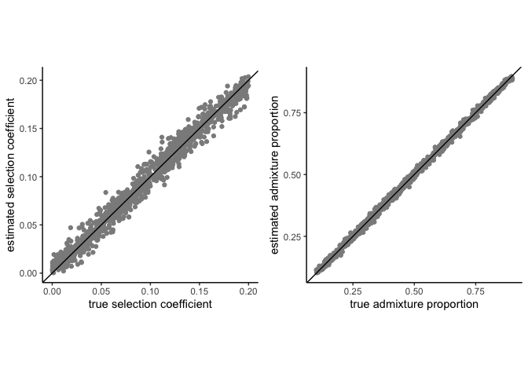

ABC
================

``` r
suppressMessages(library(tidyverse))
suppressMessages(library(abc))
suppressMessages(library(Hmisc))
suppressMessages(library(ggpubr))
```

## ABC Predictions

### Modeling Duffy-null as dominant, recessive, or additive

``` r
CV_ms_recessive <- read.table(file = "CV_ABC_recessive.txt", header=TRUE)

CV_ms_dominant <- read.table(file = "CV_ABC_dominant.txt", header=TRUE)

CV_ms_additive <- read.table(file = "CV_ABC_additive.txt", header=TRUE)
```

``` r
recessive_params <- CV_ms_recessive[, c("s", "m")]
recessive_stats <- CV_ms_recessive[, c("bene_prop", "var_prop", "median_tract", "mean_tract", "iDAT_score")]

dominant_params <- CV_ms_dominant[, c("s","m")]
dominant_stats <- CV_ms_dominant[, c("bene_prop", "var_prop", "median_tract", "mean_tract", "iDAT_score")]

additive_params <- CV_ms_additive2[, c("s","m")]
additive_stats <- CV_ms_additive2[, c("bene_prop", "var_prop", "median_tract", "mean_tract", "iDAT_score")]

Santiago_stats <- CV_stats[1, c("bene_prop", "var_prop", "median_tract", "mean_tract", "iDAT_score")]  

Santiago_nn_abc_recessive <- abc(target = Santiago_stats, param = recessive_params, sumstat = recessive_stats, tol = 0.05, method = "neuralnet", sizenet = 2)

Santiago_nn_abc_dominant <- abc(target = Santiago_stats, param = dominant_params, sumstat = dominant_stats, tol = 0.05, method = "neuralnet", sizenet = 2)

Santiago_nn_abc_additive <- abc(target = Santiago_stats, param = additive_params, sumstat = additive_stats, tol = 0.05, method = "neuralnet", sizenet = 2)
```

``` r
recessive_s <- Santiago_nn_abc_recessive$adj.values[,"s"]
recessive_m <- Santiago_nn_abc_recessive$adj.values[,"m"]

dominant_s <- Santiago_nn_abc_dominant$adj.values[,"s"]
dominant_m <- Santiago_nn_abc_dominant$adj.values[,"m"]

additive_s <- Santiago_nn_abc_additive$adj.values[,"s"]
additive_m <- Santiago_nn_abc_additive$adj.values[,"m"]

results_s <-data.frame(recessive_s, dominant_s, additive_s)
results_m <- data.frame(recessive_m, dominant_m, additive_m)

accepted_sims <- data.frame(additive_s, additive_m)
save(accepted_sims, file = "accepted_sims_additive.RData")

accepted_dominant <- data.frame(dominant_s, dominant_m)
save(accepted_sims, file = "accepted_sims_dominant.RData")

accepted_recessive <- data.frame(recessive_s, recessive_s)
save(accepted_sims, file = "accepted_sims_recessive.RData")
```

``` r
colors = c("recessive" = "#D81B60", "additive" = "#1E88E5", "dominant" = "#FFC107", "prior" = "#004D40")

s_results <- ggplot() +
    geom_histogram(data=results_s, aes(x = recessive_s, y=..density.., color = "recessive"), alpha=0.5, fill = "#D81B60", binwidth = 0.004) +
    geom_histogram(data=results_s, aes(x=dominant_s, y=..density.., color = "dominant"), alpha=0.5, fill = "#FFC107", binwidth = 0.004) +
    geom_histogram(data=results_s, aes(x=additive_s, y=..density.., color = "additive"), alpha=0.5, fill = "#1E88E5", binwidth = 0.004) +
    geom_hline(yintercept = 0, color = "white", size = 0.77) +
    xlab("selection coefficient (s)") +
    scale_color_manual(values = colors) +
    theme_classic() +
    theme(aspect.ratio = 1)

m_results <- ggplot() +
    geom_histogram(data=results_m, aes(x = recessive_m, y=..density.., color = "recessive"), alpha=0.5, fill = "#D81B60", binwidth = 0.004) +
    geom_histogram(data=results_m, aes(x=dominant_m, y=..density.., color = "dominant"), alpha=0.5, fill = "#FFC107", binwidth = 0.004) +
    geom_histogram(data=results_m, aes(x=additive_m, y=..density.., color = "additive"), alpha=0.5, fill = "#1E88E5", binwidth = 0.004) +
    geom_hline(yintercept = 0, color = "white", size = 0.77) +
    coord_cartesian(xlim = c(0.6,0.8)) +
    xlab("admixture proportion (m)") +
    scale_color_manual(values = colors) +
    theme_classic() +
    theme(aspect.ratio = 1)
```

``` r
ggarrange(s_results, m_results, ncol=2, nrow = 1, common.legend = TRUE, legend = "right", heights = c(1,1), widths = c(1,1), align = "hv")
```

<!-- -->

## Evaluating cross-validation

load results of cross-validation (see abc\_crossval\_example.R)

``` r
load("CV_ms-nn_5stats_size2_tol.RData")
```

``` r
true_additive_s <- cv.nn.ms_5stats_2_tols$true$s 
true_additive_m <- cv.nn.ms_5stats_2_tols$true$m 

pred_additive_s <- cv.nn.ms_5stats_2_tols$estim$tol0.05[,'s']
pred_additive_m <- cv.nn.ms_5stats_2_tols$estim$tol0.05[,'m']
```

``` r
s_valid <- ggplot() +
  geom_point(aes(x=true_additive_s, y = pred_additive_s), color = "gray55") +
  geom_abline(slope=1) +
  labs(x="true selection coefficient", y="estimated selection coefficient") +
  theme_classic() +
  theme(aspect.ratio = 1)

m_valid <- ggplot() +
  geom_point(aes(x=true_additive_m, y = pred_additive_m), color = "gray55") +
  geom_abline(slope=1) +
  labs(x="true admixture proportion", y="estimated admixture proportion") +
  theme_classic() +
  theme(aspect.ratio = 1)
```

``` r
ggarrange(s_valid, m_valid, ncol=2, nrow = 1, heights = c(1,1), widths = c(1,1), align = "hv")
```

<!-- -->

``` r
s_RMSE <- sqrt(mean((true_additive_s - pred_additive_s)^2))
m_RMSE <- sqrt(mean((true_additive_m - pred_additive_m)^2))

s_R2 <- summary(lm(true_additive_s~pred_additive_s))$r.squared
m_R2 <- summary(lm(true_additive_m~pred_additive_m))$r.squared

cat(s_RMSE, s_R2)
```

    ## 0.008280083 0.9784741

``` r
cat(m_RMSE, m_R2)
```

    ## 0.009000343 0.9984687
