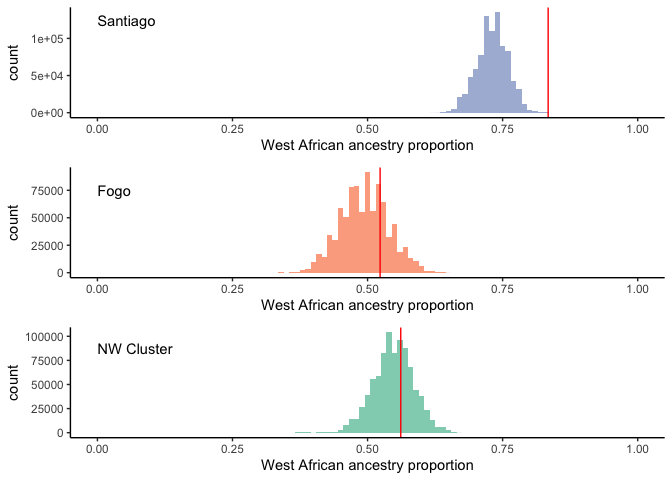
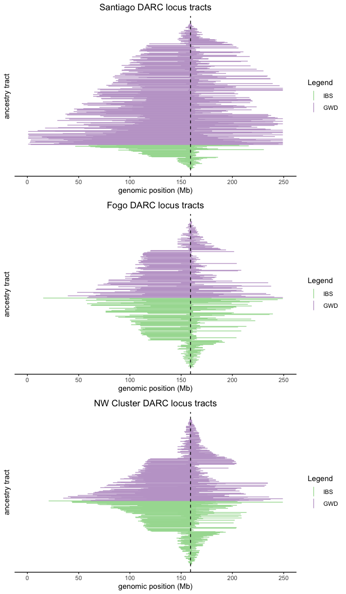
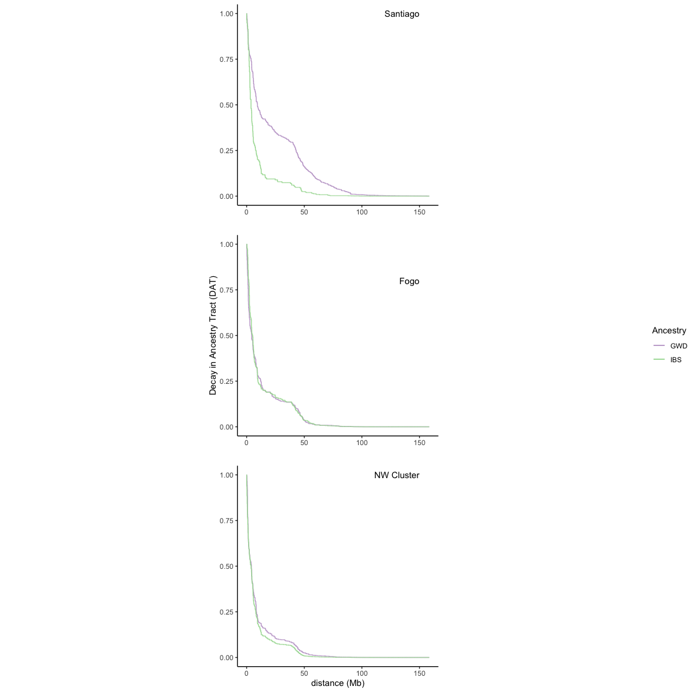
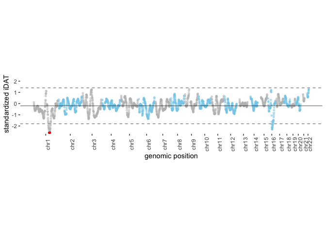
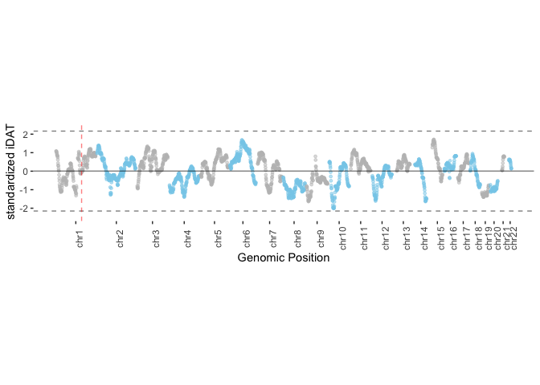
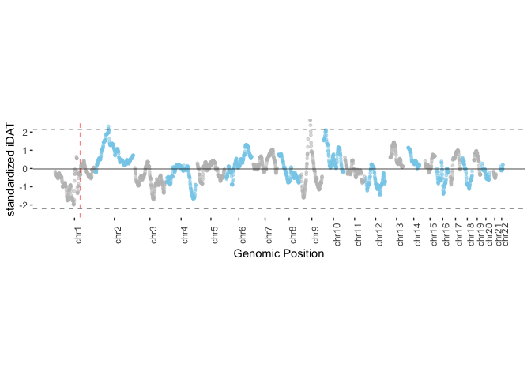
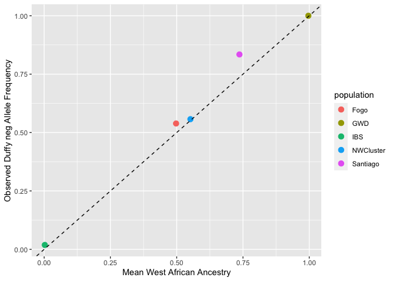

Ancestry-based stats and plots for CV
================

``` r
suppressMessages(library(tidyverse))
suppressMessages(library(magrittr))
suppressMessages(library(Hmisc))
suppressMessages(library(ggpubr))
```

## Ancestry proportion plots

``` r
#get CV local ancestry calls from RFMix -- combined & chr1 only
ancestry_prop <- read.table("LocalAncestry_ByIsland_allchr.txt", header=TRUE)
chr1 <- ancestry_prop[which(ancestry_prop$CHR=="chr1"),]
```

``` r
bene_locus <- 159174683
colors <- c("Santiago" = "#8da0cb", "Fogo" = "#fc8d62", "NW Cluster" = "#66c2a5")

#ancestry prop at DARC locus
Santiago_bene_prop <- chr1[max(which(chr1$COORD<=bene_locus)),]$SantiagoAnc1
Fogo_bene_prop <- chr1[max(which(chr1$COORD<=bene_locus)),]$FogoAnc1
NWcluster_bene_prop <- chr1[max(which(chr1$COORD<=bene_locus)),]$NWAnc1

#rank of ancestry prop at DARC locus vs all other SNPs
#Santiago
length(ancestry_prop$SantiagoAnc1) - sum(c(ancestry_prop$SantiagoAnc1 <= Santiago_bene_prop))
```

    ## [1] 0

``` r
#Fogo
length(ancestry_prop$FogoAnc1) - sum(c(ancestry_prop$FogoAnc1 <= Fogo_bene_prop))
```

    ## [1] 218469

``` r
#NW cluster
length(ancestry_prop$NWAnc1) - sum(c(ancestry_prop$NWAnc1 <= NWcluster_bene_prop))
```

    ## [1] 312548

``` r
Santiago_ancprop <- ggplot(data=ancestry_prop) +
  geom_histogram(aes(x=SantiagoAnc1, fill = "Santiago"), alpha = 0.75, binwidth = 0.01) +
  geom_vline(xintercept=Santiago_bene_prop, color="red") +
  scale_fill_manual(values=colors) +
  scale_x_continuous(limits=c(0, 1)) +
  labs(y = "count", x = "West African ancestry proportion") +
  annotate("text", x=0, y=1.25e5, label="Santiago", hjust=0) +
  theme_classic() +
  theme(legend.position = "none")

Fogo_ancprop <- ggplot(data=ancestry_prop) +
  geom_histogram(aes(x=FogoAnc1, fill = "Fogo"), alpha = 0.75, binwidth = 0.01) +
  geom_vline(xintercept=Fogo_bene_prop, color="red") +
  scale_fill_manual(values=colors) +
  scale_x_continuous(limits=c(0, 1)) +
  labs(y = "count", x = "West African ancestry proportion") +
  annotate("text", x=0, y=7.5e4, label="Fogo", hjust=0) +
  theme_classic() +
  theme(legend.position = "none")

NWcluster_ancprop <- ggplot(data=ancestry_prop) +
  geom_histogram(aes(x=NWAnc1, fill = "NW Cluster"), alpha = 0.75, binwidth = 0.01) +
  geom_vline(xintercept=NWcluster_bene_prop, color="red") +
  scale_fill_manual(values=colors) +
  scale_x_continuous(limits=c(0, 1)) +
  labs(y = "count", x = "West African ancestry proportion") +
  annotate("text", x=0, y=8.75e4, label="NW Cluster", hjust=0) +
  theme_classic() +
  theme(legend.position = "none")

ggarrange(Santiago_ancprop, Fogo_ancprop, NWcluster_ancprop, nrow = 3, ncol = 1, align = "hv")
```

    ## Warning: Removed 2 rows containing missing values (geom_bar).
    
    ## Warning: Removed 2 rows containing missing values (geom_bar).
    
    ## Warning: Removed 2 rows containing missing values (geom_bar).

<!-- -->

The following code was used to generate ancestry proportion by SNP,
along the genome. May take a few minutes to load plot.

    #!/usr/bin/env Rscript
    
    library(tidyverse)
    
    ancestry_prop <- read.table("SummarizedViterbi_IBS_GWD_CV_ByIsland_allchr.txt", header=TRUE)
    chr1 <- ancestry_prop[which(ancestry_prop$CHR=="chr1"),]
    
    ancestry_prop$chrom <- factor(ancestry_prop$CHR, levels = c("chr1", "chr2", "chr3", "chr4", "chr5", "chr6", "chr7", "chr8", "chr9", "chr10", "chr11", "chr12", "chr13", "chr14", "chr15", "chr16", "chr17", "chr18", "chr19", "chr20", "chr21", "chr22"))
    
    ancestry_prop_df <- ancestry_prop %>% 
      
      #get chr size
      group_by(chrom) %>% 
      summarise(chr_len=max(COORD)) %>% 
      
      #get cumulative coord for each chr
      mutate(tot=cumsum(as.numeric(chr_len))-chr_len) %>%
      select(-chr_len) %>%
      left_join(ancestry_prop, ., by=c("chrom"="chrom")) %>%
      
      #cumulative coord for each SNP
      arrange(chrom, COORD) %>%
      mutate(coord_cum=COORD+tot)
    
    Santiago_mean <- mean(ancestry_prop_df$SantiagoAnc1)
    Santiago_mean_sd <- sd(ancestry_prop_df$SantiagoAnc1)
    Santiago_sds <- c((Santiago_mean + (3*Santiago_mean_sd)), (Santiago_mean - (3* Santiago_mean_sd)))
    
    axisdf = ancestry_prop_df %>% group_by(chrom) %>% summarise(center = (max(coord_cum) + min(coord_cum)) / 2)
    
    bene_locus <- 159174683
    Santiago_bene_prop <- chr1[max(which(chr1$COORD<=bene_locus)),]$SantiagoAnc1
    
    color_palette <- c("#999999", "#E69F00", "#56B4E9", "#009E73", "#F0E442", "#0072B2", "#D55E00", "#CC79A7", 
                       "#999999", "#E69F00", "#56B4E9", "#009E73", "#F0E442", "#0072B2", "#D55E00", "#CC79A7",
                       "#999999", "#E69F00", "#56B4E9", "#009E73", "#F0E442", "#0072B2")
    
    ggplot(data=ancestry_prop_df, aes(x=coord_cum, y=SantiagoAnc1)) +
      geom_line(aes(color=chrom), alpha=0.5, size=0.75) +
      scale_color_manual(values = color_palette) +
      scale_x_continuous( label = axisdf$chrom, breaks= axisdf$center ) +
      #scale_y_continuous(limits=c(-2.7, 2.7), expand = c(0, 0) ) +
      geom_hline(yintercept = mean(ancestry_prop_df$SantiagoAnc1), size=0.5, alpha=0.5) +
      geom_hline(yintercept = Santiago_sds, size=0.5, alpha = 0.5, linetype = "dashed")+
      geom_point(aes(x=bene_locus, y = Santiago_bene_prop), color="red", size=1) +
      labs(x="genomic position", y="West Afrian ancestry proportion") +
      theme_bw() +
      theme( 
        legend.position="none",
        panel.border = element_blank(),
        panel.grid = element_blank(),
        axis.text.x = element_text(angle = 90),
        aspect.ratio = .2
      )

## Tract length and DAT plots

The following code was run on remote cluster to extract all ancestry
tracts by island, using results of RFmix:

    #! /usr/bin/env Rscript
    
    suppressMessages(library(tidyverse))
    suppressMessages(library(magrittr))
    
    #lists of filenames for individuals from each island
    load("Santiago_filenames.RData")
    load("Fogo_filenames.RData")
    load("NWcluster_filenames.RData")
    
    getTracts <- function(filename) {
      all_tracts <- read.table(filename, header=FALSE, col.names = c("chr", "bp_start", "bp_end", "anc", "cM_start", "cM_end"))
      all_tracts$tract_length <- all_tracts$bp_end - all_tracts$bp_start
      getIBSTracts(all_tracts)
      getGWDTracts(all_tracts)
    }
    
    getIBSTracts <- function(tracts) {
      IBS_tracts <<- bind_rows(IBS_tracts, tracts[which(tracts$anc=="IBS"),])
    }
    
    getGWDTracts <- function(tracts) {
      GWD_tracts <<- bind_rows(GWD_tracts, tracts[which(tracts$anc=="GWD"),])
    }
    
    GWD_tracts <- NULL
    IBS_tracts <- NULL
    
    mapply(filename = Santiago_files, getTracts)
    
    save(IBS_tracts, file="Santiago_IBS_tracts.RData")
    save(GWD_tracts, file="Santiago_GWD_tracts.RData")
    
    GWD_tracts <- NULL
    IBS_tracts <- NULL
    
    mapply(filename = Fogo_files, getTracts)
    
    save(IBS_tracts, file="Fogo_IBS_tracts.RData")
    save(GWD_tracts, file="Fogo_GWD_tracts.RData")
    
    GWD_tracts <- NULL
    IBS_tracts <- NULL
    
    mapply(filename = NWcluster_files, getTracts)
    
    save(IBS_tracts, file="NWcluster_IBS_tracts.RData")
    save(GWD_tracts, file="NWcluster_GWD_tracts.RData")

``` r
#get tracts spanning duffy locus by island, order by length
bene_locus <- 159174683

load("Santiago_IBS_tracts.RData")
load("Santiago_GWD_tracts.RData")

load("Fogo_IBS_tracts.RData")
load("Fogo_GWD_tracts.RData")

load("NWcluster_IBS_tracts.RData")
load("NWcluster_GWD_tracts.RData")
```

``` r
duffyGWDTracts <- function(locus, tracts) {
  duffy_ancestry <- tracts[tracts$chr==1 & tracts$bp_start <= locus & tracts$bp_end >= locus,]
  return(duffy_ancestry)
}

duffyIBSTracts <- function(locus, tracts) {
  duffy_ancestry <- tracts[tracts$chr==1 & tracts$bp_start <= locus & tracts$bp_end >= locus,]
  return(duffy_ancestry)
}

Santiago_GWD_duffy_tracts <- duffyGWDTracts(bene_locus, Santiago_GWD_tracts)
Santiago_IBS_duffy_tracts <- duffyGWDTracts(bene_locus, Santiago_IBS_tracts)

Santiago_GWD_duffy_tracts <- Santiago_GWD_duffy_tracts[order(-Santiago_GWD_duffy_tracts$tract_length),]

Santiago_IBS_duffy_tracts <- Santiago_IBS_duffy_tracts[order(Santiago_IBS_duffy_tracts$tract_length),]

Santiago_duffy_alltracts <- bind_rows(Santiago_GWD_duffy_tracts, Santiago_IBS_duffy_tracts)
Santiago_duffy_alltracts <- as.data.frame(Santiago_duffy_alltracts)

Fogo_GWD_duffy_tracts <- duffyGWDTracts(bene_locus, Fogo_GWD_tracts)
Fogo_IBS_duffy_tracts <- duffyGWDTracts(bene_locus, Fogo_IBS_tracts)

Fogo_GWD_duffy_tracts <- Fogo_GWD_duffy_tracts[order(-Fogo_GWD_duffy_tracts$tract_length),]

Fogo_IBS_duffy_tracts <- Fogo_IBS_duffy_tracts[order(Fogo_IBS_duffy_tracts$tract_length),]

Fogo_duffy_alltracts <- bind_rows(Fogo_GWD_duffy_tracts, Fogo_IBS_duffy_tracts)
Fogo_duffy_alltracts <- as.data.frame(Fogo_duffy_alltracts)

NWcluster_GWD_duffy_tracts <- duffyGWDTracts(bene_locus, NWcluster_GWD_tracts)
NWcluster_IBS_duffy_tracts <- duffyGWDTracts(bene_locus, NWcluster_IBS_tracts)

NWcluster_GWD_duffy_tracts <- NWcluster_GWD_duffy_tracts[order(-NWcluster_GWD_duffy_tracts$tract_length),]
NWcluster_IBS_duffy_tracts <- NWcluster_IBS_duffy_tracts[order(NWcluster_IBS_duffy_tracts$tract_length),]

NWcluster_duffy_alltracts <- bind_rows(NWcluster_GWD_duffy_tracts, NWcluster_IBS_duffy_tracts)
NWcluster_duffy_alltracts <- as.data.frame(NWcluster_duffy_alltracts)

Santiago_duffy_alltracts$anc2 <- factor(Santiago_duffy_alltracts$anc, levels=c('IBS','GWD'))
Fogo_duffy_alltracts$anc2 <- factor(Fogo_duffy_alltracts$anc, levels=c('IBS','GWD'))
NWcluster_duffy_alltracts$anc2 <- factor(NWcluster_duffy_alltracts$anc, levels=c('IBS','GWD'))

#DARC locus ancestry tract plots for each island
Santiago_tractplot <- ggplot()+
  geom_linerange(data=Santiago_duffy_alltracts, mapping=aes(x = 0, ymin=bp_start, ymax = bp_end, color = anc2), position=position_dodge2(width=0.3)) +
  geom_hline(yintercept=bene_locus, linetype="dashed") +
  labs(y = "genomic position (Mb)", x = "ancestry tract", color = "Legend")+
  coord_flip() +
  scale_y_continuous(limits = c(0, 25e7), labels=c("0", "50", "100", "150", "200", "250")) +
  scale_color_manual(values = c("IBS" = "#a6dba0", "GWD" = "#c2a5cf")) +
  ggtitle("Santiago DARC locus tracts")+
  theme_classic() +
  theme(plot.title = element_text(hjust=0.5), axis.line.y = element_blank(), axis.ticks.y = element_blank(), axis.text.y = element_blank())

Fogo_tractplot <- ggplot()+
  geom_linerange(data=Fogo_duffy_alltracts, mapping=aes(x = 0, ymin=bp_start, ymax = bp_end, color = anc2), position=position_dodge2(width=0.3)) +
  geom_hline(yintercept=bene_locus, linetype="dashed") +
  labs(y = "genomic position (Mb)", x = "ancestry tract", color = "Legend")+
  coord_flip() +
  scale_y_continuous(limits = c(0, 25e7), labels=c("0", "50", "100", "150", "200", "250")) +
  scale_color_manual(values = c("IBS" = "#a6dba0", "GWD" = "#c2a5cf")) +
  ggtitle("Fogo DARC locus tracts")+
  theme_classic() +
  theme(plot.title = element_text(hjust=0.5), axis.line.y = element_blank(), axis.ticks.y = element_blank(), axis.text.y = element_blank())

NWcluster_tractplot <- ggplot()+
  geom_linerange(data=NWcluster_duffy_alltracts, mapping=aes(x = 0, ymin=bp_start, ymax = bp_end, color = anc2), position=position_dodge2(width=0.3)) +
  geom_hline(yintercept=bene_locus, linetype="dashed") +
  labs(y = "genomic position (Mb)", x = "ancestry tract", color = "Legend")+
  coord_flip() +
  scale_y_continuous(limits = c(0, 25e7), labels=c("0", "50", "100", "150", "200", "250")) +
  scale_color_manual(values = c("IBS" = "#a6dba0", "GWD" = "#c2a5cf")) +
  ggtitle("NW Cluster DARC locus tracts")+
  theme_classic() +
  theme(plot.title = element_text(hjust=0.5), axis.line.y = element_blank(), axis.ticks.y = element_blank(), axis.text.y = element_blank())

ggarrange(Santiago_tractplot, Fogo_tractplot, NWcluster_tractplot, nrow=3, ncol=1, heights = c(1,1), widths=c(1,1), align = "hv")
```

<!-- -->

``` r
#unstandardized iHS calculation by island
calcDAT <- function(distance, haplotypes) {
  haplotype_proportions <- sum(c(haplotypes >= distance)) / length(haplotypes)
  DAT <- haplotype_proportions^2
  return(DAT)
}

calciDAT <- function(distance, DAT){
  suppressMessages(require(pracma))
  trapz_auc <- trapz(distance, DAT)
  return(trapz_auc)
}

#get SNP positions
chr1_coords <- as.data.frame(chr1$COORD)
chr1_coords$distance <- abs(bene_locus - chr1_coords$`chr1$COORD`)
names(chr1_coords)[1] <- "coord"

#get tract lengths as function of distance from duffy locus
#Santiago
Santiago_GWD_haplotypes <- c((Santiago_duffy_alltracts[which(Santiago_duffy_alltracts$anc=="GWD"),]$bp_end - bene_locus), (bene_locus- Santiago_duffy_alltracts[which(Santiago_duffy_alltracts$anc=="GWD"),]$bp_start))

Santiago_IBS_haplotypes <- c((Santiago_duffy_alltracts[which(Santiago_duffy_alltracts$anc=="IBS"),]$bp_end - bene_locus), (bene_locus- Santiago_duffy_alltracts[which(Santiago_duffy_alltracts$anc=="IBS"),]$bp_start))

#Fogo
Fogo_GWD_haplotypes <- c((Fogo_duffy_alltracts[which(Fogo_duffy_alltracts$anc=="GWD"),]$bp_end - bene_locus), (bene_locus- Fogo_duffy_alltracts[which(Fogo_duffy_alltracts$anc=="GWD"),]$bp_start))

Fogo_IBS_haplotypes <- c((Fogo_duffy_alltracts[which(Fogo_duffy_alltracts$anc=="IBS"),]$bp_end - bene_locus), (bene_locus- Fogo_duffy_alltracts[which(Fogo_duffy_alltracts$anc=="IBS"),]$bp_start))

#NW Cluster
NWcluster_GWD_haplotypes <- c((NWcluster_duffy_alltracts[which(NWcluster_duffy_alltracts$anc=="GWD"),]$bp_end - bene_locus), (bene_locus- NWcluster_duffy_alltracts[which(NWcluster_duffy_alltracts$anc=="GWD"),]$bp_start))

NWcluster_IBS_haplotypes <- c((NWcluster_duffy_alltracts[which(NWcluster_duffy_alltracts$anc=="IBS"),]$bp_end - bene_locus), (bene_locus- NWcluster_duffy_alltracts[which(NWcluster_duffy_alltracts$anc=="IBS"),]$bp_start))

#calculate DAT as the square of frequency of tract lengths at each absolute distance
chr1_coords$Santiago_GWD_DAT <- sapply(chr1_coords$distance,calcDAT, haplotypes=Santiago_GWD_haplotypes)
chr1_coords$Santiago_IBS_DAT <- sapply(chr1_coords$distance,calcDAT, haplotypes=Santiago_IBS_haplotypes)

chr1_coords$Fogo_GWD_DAT <- sapply(chr1_coords$distance,calcDAT, haplotypes=Fogo_GWD_haplotypes)
chr1_coords$Fogo_IBS_DAT <- sapply(chr1_coords$distance,calcDAT, haplotypes=Fogo_IBS_haplotypes)

chr1_coords$NWcluster_GWD_DAT <- sapply(chr1_coords$distance,calcDAT, haplotypes=NWcluster_GWD_haplotypes)
chr1_coords$NWcluster_IBS_DAT <- sapply(chr1_coords$distance,calcDAT, haplotypes=NWcluster_IBS_haplotypes)

#iDAT calculations
Santiago_iDAT_GWD <- chr1_coords[which(chr1_coords$Santiago_GWD_DAT>=0.25),]
Santiago_iDAT_GWD <- Santiago_iDAT_GWD[order(Santiago_iDAT_GWD$distance),]

Santiago_iDAT_IBS <- chr1_coords[which(chr1_coords$Santiago_IBS_DAT>=0.25),]
Santiago_iDAT_IBS <- Santiago_iDAT_IBS[order(Santiago_iDAT_IBS$distance),]

Fogo_iDAT_GWD <- chr1_coords[which(chr1_coords$Fogo_GWD_DAT>=0.25),]
Fogo_iDAT_GWD <- Fogo_iDAT_GWD[order(Fogo_iDAT_GWD$distance),]

Fogo_iDAT_IBS <- chr1_coords[which(chr1_coords$Fogo_IBS_DAT>=0.25),]
Fogo_iDAT_IBS <- Fogo_iDAT_IBS[order(Fogo_iDAT_IBS$distance),]

NWcluster_iDAT_GWD <- chr1_coords[which(chr1_coords$NWcluster_GWD_DAT>=0.25),]
NWcluster_iDAT_GWD <- NWcluster_iDAT_GWD[order(NWcluster_iDAT_GWD$distance),]

NWcluster_iDAT_IBS <- chr1_coords[which(chr1_coords$NWcluster_IBS_DAT>=0.25),]
NWcluster_iDAT_IBS <- NWcluster_iDAT_IBS[order(NWcluster_iDAT_IBS$distance),]


iDAT_Santiago_IBS <- calciDAT(Santiago_iDAT_IBS$distance, Santiago_iDAT_IBS$Santiago_IBS_DAT)
iDAT_Santiago_GWD <- calciDAT(Santiago_iDAT_GWD$distance, Santiago_iDAT_GWD$Santiago_GWD_DAT)

iDAT_Fogo_IBS <- calciDAT(Fogo_iDAT_IBS$distance, Fogo_iDAT_IBS$Fogo_IBS_DAT)
iDAT_Fogo_GWD <- calciDAT(Fogo_iDAT_GWD$distance, Fogo_iDAT_GWD$Fogo_GWD_DAT)

iDAT_NWcluster_IBS <- calciDAT(NWcluster_iDAT_IBS$distance, NWcluster_iDAT_IBS$NWcluster_IBS_DAT)
iDAT_NWcluster_GWD <- calciDAT(NWcluster_iDAT_GWD$distance, NWcluster_iDAT_GWD$NWcluster_GWD_DAT)

#iDAT score calculation
#Santiago
log(iDAT_Santiago_IBS/iDAT_Santiago_GWD)
```

    ## [1] -1.444692

``` r
#Fogo
log(iDAT_Fogo_IBS/iDAT_Fogo_GWD)
```

    ## [1] -0.04941405

``` r
#NW Cluster
log(iDAT_NWcluster_IBS/iDAT_NWcluster_GWD)
```

    ## [1] -0.08443489

``` r
#plot DAT
Santiago_DATplot <- ggplot(chr1_coords) +
  geom_line(aes(x=distance, y=Santiago_GWD_DAT, color = "GWD")) +
  geom_line(aes(x=distance, y = Santiago_IBS_DAT, color = "IBS")) +
  scale_color_manual(values = c("IBS" = "#a6dba0", "GWD" = "#c2a5cf")) +
  scale_x_continuous(labels=c("0", "50", "100", "150")) +
  labs(color = "Ancestry") +
  annotate("text", x=1.5e8, y=1, hjust=1, label="Santiago") +
  theme_classic() +
  theme(aspect.ratio = 1,  axis.title = element_blank())

Fogo_DATplot <- ggplot(chr1_coords) +
  geom_line(aes(x=distance, y=Fogo_GWD_DAT, color = "GWD")) +
  geom_line(aes(x=distance, y = Fogo_IBS_DAT, color = "IBS")) +
  scale_color_manual(values = c("IBS" = "#a6dba0", "GWD" = "#c2a5cf")) +
  scale_x_continuous(labels=c("0", "50", "100", "150")) +
  labs(y = "Decay in Ancestry Tract (DAT)", color = "Ancestry") +
  annotate("text", x=1.5e8, y=0.8, hjust=1, label="Fogo") +
  theme_classic() +
  theme(aspect.ratio = 1, axis.title.x = element_blank())

NWcluster_DATplot <- ggplot(chr1_coords) +
  geom_line(aes(x=distance, y=NWcluster_GWD_DAT, color = "GWD")) +
  geom_line(aes(x=distance, y = NWcluster_IBS_DAT, color = "IBS")) +
  scale_color_manual(values = c("IBS" = "#a6dba0", "GWD" = "#c2a5cf")) +
  scale_x_continuous(labels=c("0", "50", "100", "150")) +
  labs(x = "distance (Mb)", color = "Ancestry") +
  annotate("text", x=1.5e8, y=1, hjust=1, label="NW Cluster") +
  theme_classic() +
  theme(aspect.ratio = 1, axis.title.y = element_blank())

ggarrange(Santiago_DATplot, Fogo_DATplot, NWcluster_DATplot, nrow=3, ncol=1, heights = c(1,1), widths=c(1,1), align = "hv", common.legend = TRUE, legend = "right")
```

<!-- -->

## Ancestry-based stats calculations

``` r
#median tract length 
Santiago_median_tract <- median(log(Santiago_GWD_duffy_tracts$tract_length))
Fogo_median_tract <- median(log(Fogo_GWD_duffy_tracts$tract_length))
NWcluster_median_tract <- median(log(NWcluster_GWD_duffy_tracts$tract_length))

median_tract <- c(Santiago_median_tract, Fogo_median_tract, NWcluster_median_tract)

#mean tract length
Santiago_mean_tract <- mean(log(Santiago_GWD_duffy_tracts$tract_length))
Fogo_mean_tract <- mean(log(Fogo_GWD_duffy_tracts$tract_length))
NWcluster_mean_tract <- mean(log(NWcluster_GWD_duffy_tracts$tract_length))

mean_tract <- c(Santiago_mean_tract, Fogo_mean_tract, NWcluster_mean_tract)

#variance in tract length
Santiago_var_tract <- var(log(Santiago_GWD_duffy_tracts$tract_length))
Fogo_var_tract <- var(log(Fogo_GWD_duffy_tracts$tract_length))
NWcluster_var_tract <- var(log(NWcluster_GWD_duffy_tracts$tract_length))

var_tract <- c(Santiago_var_tract, Fogo_var_tract, NWcluster_var_tract)

#95% quantile of tract length that includes duffy
Santiago_q95_tract <- quantile(log(Santiago_GWD_duffy_tracts$tract_length), .95, names=FALSE)
Fogo_q95_tract <- quantile(log(Fogo_GWD_duffy_tracts$tract_length), .95, names=FALSE)
NWcluster_q95_tract <- quantile(log(NWcluster_GWD_duffy_tracts$tract_length), .95, names=FALSE)

q95_tract <- c(Santiago_q95_tract, Fogo_q95_tract, NWcluster_q95_tract)

#proportion of individuals with tract length above 75% and 95% of the chromosome
Santiago_length_75_prop <- mean(Santiago_GWD_duffy_tracts$tract_length > (249904549.0*.75))
Santiago_length_95_prop <- mean(Santiago_GWD_duffy_tracts$tract_length > (249904549.0*.95))

Fogo_length_75_prop <- mean(Fogo_GWD_duffy_tracts$tract_length > (249904549.0*.75))
Fogo_length_95_prop <- mean(Fogo_GWD_duffy_tracts$tract_length > (249904549.0*.95))

NWcluster_length_75_prop <- mean(NWcluster_GWD_duffy_tracts$tract_length > (249904549.0*.75))
NWcluster_length_95_prop <- mean(NWcluster_GWD_duffy_tracts$tract_length > (249904549.0*.95))

length_75_prop <- c(Santiago_length_75_prop, Fogo_length_75_prop, NWcluster_length_75_prop)
length_95_prop <- c(Santiago_length_95_prop, Fogo_length_95_prop, NWcluster_length_95_prop)

#95% quantile of chr 1 ancestry prop
Santiago_q95_prop <- quantile(chr1$SantiagoAnc1, .95, names=FALSE)
Fogo_q95_prop <- quantile(chr1$FogoAnc1, .95, names=FALSE)
NWcluster_q95_prop <- quantile(chr1$NWAnc1, .95, names=FALSE)

q95_prop <- c(Santiago_q95_prop, Fogo_q95_prop, NWcluster_q95_prop)

#ancestry prop at DARC locus
Santiago_bene_prop <- chr1[max(which(chr1$COORD<=bene_locus)),]$SantiagoAnc1
Fogo_bene_prop <- chr1[max(which(chr1$COORD<=bene_locus)),]$FogoAnc1
NWcluster_bene_prop <- chr1[max(which(chr1$COORD<=bene_locus)),]$NWAnc1

bene_prop <- c(Santiago_bene_prop, Fogo_bene_prop, NWcluster_bene_prop)

#ancestry percentile rank for DARC locus
Santiago_bene_rank <- mean(c(chr1$SantiagoAnc1 < Santiago_bene_prop))
Fogo_bene_rank <- mean(c(chr1$FogoAnc1 < Fogo_bene_prop))
NWcluster_bene_rank <- mean(c(chr1$NWAnc1 < NWcluster_bene_prop))

bene_rank <- c(Santiago_bene_rank, Fogo_bene_rank, NWcluster_bene_rank)

#mean chr 1 ancestry
Santiago_mean_global <- mean(chr1$SantiagoAnc1)
Fogo_mean_global <- mean(chr1$FogoAnc1)
NWcluster_mean_global <- mean(chr1$NWAnc1)

mean_global <- c(Santiago_mean_global, Fogo_mean_global, NWcluster_mean_global)

#var in chr1 ancestry
Santiago_var_prop <- var(chr1$SantiagoAnc1)
Fogo_var_prop <- var(chr1$FogoAnc1)
NWcluster_var_prop <- var(chr1$NWAnc1)

var_prop <- c(Santiago_var_prop, Fogo_var_prop, NWcluster_var_prop)

#avg ancestry switches
Santiago_avg_switches <- ((sum(c(Santiago_GWD_tracts$chr==1)) + sum(c(Santiago_IBS_tracts$chr==1))) - 344) / 344
Fogo_avg_switches <- ((sum(c(Fogo_GWD_tracts$chr==1)) + sum(c(Fogo_IBS_tracts$chr==1))) - 258) / 258
NWcluster_avg_switches <- ((sum(c(NWcluster_GWD_tracts$chr==1)) + sum(c(NWcluster_IBS_tracts$chr==1))) - 472) / 472

avg_switches <- c(Santiago_avg_switches, Fogo_avg_switches, NWcluster_avg_switches)

#var in ancestry prop in 10 Mb window surrounding Duffy-null
tenMb_window_start <- bene_locus - 5000000.0
tenMb_window_end <- bene_locus + 5000000.0

lower <- chr1[which(chr1$COORD>=tenMb_window_start & chr1$COORD<=bene_locus),]
upper <- chr1[which(chr1$COORD<=tenMb_window_end & chr1$COORD>bene_locus),]

prop_10Mb <- bind_rows(lower, upper)

Santiago_var_prop_10Mb <- var(prop_10Mb$SantiagoAnc1)
Fogo_var_prop_10Mb <- var(prop_10Mb$FogoAnc1)
NWcluster_var_prop_10Mb <- var(prop_10Mb$NWAnc1)

var_prop_10Mb <- c(Santiago_var_prop_10Mb, Fogo_var_prop_10Mb, NWcluster_var_prop_10Mb)
```

The following code was run on remote cluster to calculate mean chr1 West
African ancestry based on tract lengths:

    #! /usr/bin/env Rscript
    #SBATCH -p common
    #SBATCH --mem=10G
    
    suppressMessages(library(tidyverse))
    suppressMessages(library(magrittr))
    
    #load filenames for individuals from each island
    load("Santiago_filenames.RData")
    load("Fogo_filenames.RData")
    load("NWcluster_filenames.RData")
    
    getTracts <- function(filename) {
      all_tracts <- read.table(filename, header=FALSE, col.names = c("chr", "bp_start", "bp_end", "anc", "cM_start", "cM_end"))
      all_tracts$tract_length <- all_tracts$bp_end - all_tracts$bp_start
      GWD_chr1_tracts <- getGWDTracts(all_tracts)
      chrom_length <- 249904549.0
      global_anc <- (sum(as.numeric(GWD_chr1_tracts$tract_length))/chrom_length)
      child_name <- getChildName(filename)
      return(c(global_anc, child_name))
    }
    
    getGWDTracts <- function(tracts) {
      GWD_chr1_tracts <- tracts[tracts$anc=="GWD" & tracts$chr=="1",]
      return(GWD_chr1_tracts)
    }
    
    getChildName <- function(filename) {
      pattern <- "^.+CV_GWD_IBS/(\\d+(_R)*)_(A|B).bed"
      pattern_match <- str_match(filename, pattern)
      child_name <- pattern_match[,2]
    
      return(child_name)
    }
    
    Santiago_globalancestry <- as.data.frame(t(mapply(filename = Santiago_files, getTracts)))
    
    save(Santiago_globalancestry, file="Santiago_globalancestry.RData")
    
    Fogo_globalancestry <- as.data.frame(t(mapply(filename = Fogo_files, getTracts)))
    
    save(Fogo_globalancestry, file="Fogo_globalancestry.RData")
    
    NWcluster_globalancestry <- as.data.frame(t(mapply(filename = NWcluster_files, getTracts)))
    
    save(NWcluster_globalancestry, file="NWcluster_globalancestry.RData")

``` r
#load mean chr1 ancestry based on tract lengths
load("NWcluster_globalancestry.RData")
load("Fogo_globalancestry.RData")
load("Santiago_globalancestry.RData")
```

``` r
#proportion of individuals with global ancestry > 0.75

options(digits = 5)

globalAncestry <- function (child, ancestry_tracts){
  global_ancestry = (ancestry_tracts$global_prop[child] + ancestry_tracts$global_prop[child+1])/2
  return(global_ancestry)
}

Santiago_global <- as.data.frame(as.numeric(as.character(Santiago_globalancestry$V1)))
Santiago_global$child <- Santiago_globalancestry$V2
names(Santiago_global)[1] <- "global_prop"

num_samples <- nrow(Santiago_global)
child_indices <- as.data.frame(seq(from=1, to=num_samples, by=2))
Santiago_true_globalancestry <- sapply(child_indices, globalAncestry, ancestry_tracts=Santiago_global)
Santiago_global_75_prop <- sum(c(Santiago_true_globalancestry>=0.75))/(num_samples/2)

NWcluster_global <- as.data.frame(as.numeric(as.character(NWcluster_globalancestry$V1)))
NWcluster_global$child <- NWcluster_globalancestry$V2
names(NWcluster_global)[1] <- "global_prop"

num_samples <- nrow(NWcluster_global)
child_indices <- as.data.frame(seq(from=1, to=num_samples, by=2))
NWcluster_true_globalancestry <- sapply(child_indices, globalAncestry, ancestry_tracts=NWcluster_global)
NWcluster_global_75_prop <- sum(c(NWcluster_true_globalancestry>=0.75))/(num_samples/2)


Fogo_global <- as.data.frame(as.numeric(as.character(Fogo_globalancestry$V1)))
Fogo_global$child <- Fogo_globalancestry$V2
names(Fogo_global)[1] <- "global_prop"

num_samples <- nrow(Fogo_global)
child_indices <- as.data.frame(seq(from=1, to=num_samples, by=2))
Fogo_true_globalancestry <- sapply(child_indices, globalAncestry, ancestry_tracts=Fogo_global)
Fogo_global_75_prop <- sum(c(Fogo_true_globalancestry>=0.75))/(num_samples/2)

global_75_prop <- c(Santiago_global_75_prop, Fogo_global_75_prop, NWcluster_global_75_prop)
```

``` r
#unstandardized iDAT score

Santiago_iDAT_unstand <- log(iDAT_Santiago_IBS/iDAT_Santiago_GWD)
Fogo_iDAT_unstand <- log(iDAT_Fogo_IBS/iDAT_Fogo_GWD)
NWcluster_iDAT_unstand <- log(iDAT_NWcluster_IBS/iDAT_NWcluster_GWD)

iDAT_score <- c(Santiago_iDAT_unstand, Fogo_iDAT_unstand, NWcluster_iDAT_unstand)
```

The following code was run to randomly draw 10000 SNP positions from
available data:

    CV_sample <- sample_n(CV_ancestry_prop, 10000)
    CV_sample_chr <- CV_sample$CHR
    CV_sample_coords <- CV_sample$COORD
    
    save(CV_sample_chr, file = "CV_sample_chr.RData")
    save(CV_sample_coords, file = "CV_sample_coords.RData")

Then, the following code was run on remote cluster to calculate
unstandardized iDAT for 10000 random positions in the genome for the NW
cluster. The same script was edited and run for Santiago and Fogo using
the same positions:

    #!/usr/bin/env Rscript
    
    #SBATCH -p common
    #SBATCH --mem=20G
    
    suppressMessages(library(tidyverse))
    
    #load results of RFMix
    CV_ancestry_prop <- read.table("LocalAncestry_ByIsland_allchr.txt", header=TRUE)
    
    chr1 <- CV_ancestry_prop[which(CV_ancestry_prop$CHR=="chr1"),]
    chr2 <- CV_ancestry_prop[which(CV_ancestry_prop$CHR=="chr2"),]
    chr3 <- CV_ancestry_prop[which(CV_ancestry_prop$CHR=="chr3"),]
    chr4 <- CV_ancestry_prop[which(CV_ancestry_prop$CHR=="chr4"),]
    chr5 <- CV_ancestry_prop[which(CV_ancestry_prop$CHR=="chr5"),]
    chr6 <- CV_ancestry_prop[which(CV_ancestry_prop$CHR=="chr6"),]
    chr7 <- CV_ancestry_prop[which(CV_ancestry_prop$CHR=="chr7"),]
    chr8 <- CV_ancestry_prop[which(CV_ancestry_prop$CHR=="chr8"),]
    chr9 <- CV_ancestry_prop[which(CV_ancestry_prop$CHR=="chr9"),]
    chr10 <- CV_ancestry_prop[which(CV_ancestry_prop$CHR=="chr10"),]
    chr11 <- CV_ancestry_prop[which(CV_ancestry_prop$CHR=="chr11"),]
    chr12 <- CV_ancestry_prop[which(CV_ancestry_prop$CHR=="chr12"),]
    chr13 <- CV_ancestry_prop[which(CV_ancestry_prop$CHR=="chr13"),]
    chr14 <- CV_ancestry_prop[which(CV_ancestry_prop$CHR=="chr14"),]
    chr15 <- CV_ancestry_prop[which(CV_ancestry_prop$CHR=="chr15"),]
    chr16 <- CV_ancestry_prop[which(CV_ancestry_prop$CHR=="chr16"),]
    chr17 <- CV_ancestry_prop[which(CV_ancestry_prop$CHR=="chr17"),]
    chr18 <- CV_ancestry_prop[which(CV_ancestry_prop$CHR=="chr18"),]
    chr19 <- CV_ancestry_prop[which(CV_ancestry_prop$CHR=="chr19"),]
    chr20 <- CV_ancestry_prop[which(CV_ancestry_prop$CHR=="chr20"),]
    chr21 <- CV_ancestry_prop[which(CV_ancestry_prop$CHR=="chr21"),]
    chr22 <- CV_ancestry_prop[which(CV_ancestry_prop$CHR=="chr22"),]
    
    #unstandardized iDAT calculation by island
    load("NWcluster_IBS_tracts.RData")
    load("NWcluster_GWD_tracts.RData")
    
    NWcluster_all_tracts <- bind_rows(IBS_tracts, GWD_tracts)
    
    #load list of 10000 random genomic positions and corresponding chromosome (to keep positions consistent across islands)
    load("CV_sample_chr.RData")
    load("CV_sample_coords.RData")
    
    locusAllTracts <- function(locus, tracts, chr) {
      locus_ancestry <- tracts[tracts$chr==chr & tracts$bp_start <= locus & tracts$bp_end >= locus,]
      return(locus_ancestry)
    }
    
    calcDAT <- function(distance, haplotypes) {
      haplotype_proportions <- sum(c(haplotypes >= distance)) / length(haplotypes)
      DAT <- haplotype_proportions^2
      return(DAT)
    }
    
    calciDAT <- function(distance, DAT){
      suppressMessages(require(pracma))
      trapz_auc <- trapz(distance, DAT)
      return(trapz_auc)
    }
    
    #get ancestry-informative SNP positions
    getCoords <- function(chr, locus) {
      chr_coords <- as.data.frame(chr$COORD)
      names(chr_coords) <- "coord"
      chr_coords$distance <- abs(chr_coords$coord - locus)
      return(chr_coords)
    }
    
    CalciDAT_abs <- function(chr, locus, all_tracts) {
      all_tracts_df <- get(all_tracts)
      all_tracts_df$chr <- paste0("chr", all_tracts_df$chr)
      locus_tracts <- as.data.frame(locusAllTracts(locus, all_tracts_df, chr))
    
      GWD_haplotypes <- c((locus_tracts[which(locus_tracts$anc=="GWD"),]$bp_end - locus), (locus - locus_tracts[which(locus_tracts$anc=="GWD"),]$bp_start))
    
      IBS_haplotypes <- c((locus_tracts[which(locus_tracts$anc=="IBS"),]$bp_end - locus), (locus - locus_tracts[which(locus_tracts$anc=="IBS"),]$bp_start))
    
      chr_coords <- getCoords_abs(get(chr), locus)
    
      chr_coords$GWD_DAT <- sapply(chr_coords$distance,calcDAT, haplotypes=GWD_haplotypes)
      chr_coords$IBS_DAT <- sapply(chr_coords$distance,calcDAT, haplotypes=IBS_haplotypes)
    
      iDAT_GWD <- chr_coords[which(chr_coords$GWD_DAT>=0.25),]
      iDAT_GWD <- iDAT_GWD[order(iDAT_GWD$distance),]
    
      iDAT_IBS <- chr_coords[which(chr_coords$IBS_DAT>=0.25),]
      iDAT_IBS <- iDAT_IBS[order(iDAT_IBS$distance),]
    
      IBS_iDAT <- calciDAT(iDAT_IBS$distance, iDAT_IBS$IBS_DAT)
      GWD_iDAT <- calciDAT(iDAT_GWD$distance, iDAT_GWD$GWD_DAT)
    
      locus_iDAT <- log(IBS_iDAT/GWD_iDAT)
    
      iDAT_vector <<- c(iDAT_vector, locus_iDAT)
    }
    
    iDAT_vector <- NULL
    
    tracts <- rep("NWcluster_all_tracts", 10000)
    mapply(chr=CV_sample_chr, CalciDAT_abs, locus=CV_sample_coords, all_tracts = tracts)
    
    NWcluster_iDAT_vector_abs <- iDAT_vector
    
    save(NWcluster_iDAT_vector_abs, file = "NWcluster_iDAT_vector_abs.RData")

``` r
#load iDAT score from 10000 random positions

load("Santiago_iDAT_vector_abs.RData")
load("Fogo_iDAT_vector_abs.RData")
load("NWcluster_iDAT_vector_abs.RData")

Santiago_iDAT_stand <- (Santiago_iDAT_unstand - mean(Santiago_iDAT_vector_abs)) / sd(Santiago_iDAT_vector_abs)
Fogo_iDAT_stand <- (Fogo_iDAT_unstand - mean(Fogo_iDAT_vector_abs)) / sd(Fogo_iDAT_vector_abs)
NWcluster_iDAT_stand <- (NWcluster_iDAT_anc_unstand - mean(NWcluster_iDAT_vector_abs)) / sd(NWcluster_iDAT_vector_abs)
```

``` r
#put stats together in data frame
island <- c("Santiago", "Fogo", "NW Cluster")

CV_stats <- data.frame(island, bene_rank, bene_prop, mean_global, var_prop, var_prop_10Mb, q95_prop, median_tract, mean_tract, var_tract, q95_tract, length_75_prop, length_95_prop, avg_switches, global_75_prop, iDAT_score, iDAT_stand)

CV_stats
```

    ##       island bene_rank bene_prop mean_global   var_prop var_prop_10Mb q95_prop
    ## 1   Santiago   0.99727   0.83430     0.75023 0.00078653    0.00040037  0.80523
    ## 2       Fogo   0.77912   0.52326     0.48880 0.00162636    0.00031468  0.55039
    ## 3 NW Cluster   0.51252   0.56144     0.56465 0.00153985    0.00042935  0.64195
    ##   median_tract mean_tract var_tract q95_tract length_75_prop length_95_prop
    ## 1       18.255     18.014   0.94372    19.041      0.0452962      0.0034843
    ## 2       17.758     17.326   1.28610    18.594      0.0074074      0.0000000
    ## 3       17.584     17.122   1.34084    18.602      0.0000000      0.0000000
    ##   avg_switches global_75_prop iDAT_score iDAT_stand
    ## 1       11.590      0.5581395  -1.444692   -1.76919
    ## 2       14.535      0.0077519  -0.049414   -0.18640
    ## 3       16.265      0.0338983  -0.084435    0.67124

``` r
write.table(CV_stats, file="CV_stats.txt", quote = FALSE, row.names = FALSE)
```

## Genome-wide iDAT plots

``` r
#chr coordinates of 10000 positions where iDAT was calculated
load("CV_sample_coords.RData")

#list of chr that coorespond with each coordinate
load("CV_sample_chr.RData")
```

``` r
iDAT_df <- data.frame(CV_sample_chr, CV_sample_coords, Santiago_iDAT_vector_abs, Fogo_iDAT_vector_abs, NWcluster_iDAT_vector_abs)
names(iDAT_df) <- c("chr", "coord", "Santiago_iDAT", "Fogo_iDAT", "NWcluster_iDAT")

#add row for Duffy-null SNP
iDAT_df %<>% add_row(chr = "chr1", coord = bene_locus, Santiago_iDAT = Santiago_iDAT_unstand, Fogo_iDAT = Fogo_iDAT_unstand, NWcluster_iDAT = NWcluster_iDAT_unstand)

iDAT_df$chrom <- factor(iDAT_df$chr, levels = c("chr1", "chr2", "chr3", "chr4", "chr5", "chr6", "chr7", "chr8", "chr9", "chr10", "chr11", "chr12", "chr13", "chr14", "chr15", "chr16", "chr17", "chr18", "chr19", "chr20", "chr21", "chr22"))


manhattan_iDAT_df <- iDAT_df %>% 
  
  #get chr size
  group_by(chrom) %>% 
  summarise(chr_len=max(coord)) %>% 
  
  #get cumulative coord for each chr
  mutate(tot=cumsum(as.numeric(chr_len))-chr_len) %>%
  select(-chr_len) %>%
  left_join(iDAT_df, ., by=c("chrom"="chrom")) %>%
  
  #cumulative coord for each SNP
  arrange(chrom, coord) %>%
  mutate(coord_cum=coord+tot)
```

    ## `summarise()` ungrouping output (override with `.groups` argument)

``` r
#save intermediate file
save(manhattan_iDAT_df, file="manhattan_iDAT_df.RData")
```

``` r
#standardize iDAT scores
manhattan_iDAT_df$Santiago_iDAT_stand <- (manhattan_iDAT_df$Santiago_iDAT - mean(manhattan_iDAT_df$Santiago_iDAT)) / sd(manhattan_iDAT_df$Santiago_iDAT)
manhattan_iDAT_df$Fogo_iDAT_stand <- (manhattan_iDAT_df$Fogo_iDAT - mean(manhattan_iDAT_df$Fogo_iDAT)) / sd(manhattan_iDAT_df$Fogo_iDAT)
manhattan_iDAT_df$NWcluster_iDAT_stand <- (manhattan_iDAT_df$NWcluster_iDAT - mean(manhattan_iDAT_df$NWcluster_iDAT)) / sd(manhattan_iDAT_df$NWcluster_iDAT)

chr_lengths <- c(249904550,243199373,198022430,191535534,180915260,171115067,159321559,146440111,141696573,135534747,135046619,133851895,115169878,107349540,102531392,90354753,81529607,78081510,59380841,63025520,48157577,51304566)
chr_names <- levels(manhattan_iDAT_df$chrom)

#get bp coordinates for 20Mb windows
windowCoords <- function(chr) {
  chr_len <- chr_lengths[which(chr_names==chr)]
  chr_start <- manhattan_iDAT_df[manhattan_iDAT_df$chr==chr, "coord"][1]
  start_bp <- c(seq(chr_start, chr_len-20000000, 1000000), chr_len-20000000)
  end_bp <- c(seq(chr_start+20000000, chr_len, 1000000), chr_len)
  chrom_coords <<- add_row(chrom_coords, start_bp=start_bp, end_bp=end_bp, chr=chr)
}

#get indices in manhattan_iDAT_df for each window
bp_indices <- function(x) {
  window_coords <- manhattan_iDAT_df[(manhattan_iDAT_df$chr==chrom_coords$chr[x] & manhattan_iDAT_df$coord <= chrom_coords$end_bp[x] & manhattan_iDAT_df$coord >= chrom_coords$start_bp[x]),"coord"]
  if(length(window_coords)) {
    start_index <- which(manhattan_iDAT_df$coord == min(window_coords))
    end_index <- which(manhattan_iDAT_df$coord == max(window_coords))
    x1 <- x
    indices <<- add_row(indices, start_index, end_index, x1)
  }
}

#calculate mean of each window based on indices
meanWindow <- function(x, column_name) {
  windowMean <- mean(manhattan_iDAT_df[chrom_coords_narm$start_index[x]:chrom_coords_narm$end_index[x],column_name])
  mean_vector <<- c(mean_vector, windowMean)
}


#create window bp coordinate df with chr1
chrom_coords <- NULL
chr_len <- chr_lengths[which(chr_names=="chr1")]
chr_start <- manhattan_iDAT_df[manhattan_iDAT_df$chr=="chr1", "coord"][1]
start_bp <- c(seq(chr_start, chr_len-20000000, 1000000), chr_len-20000000)
end_bp <- c(seq(chr_start+20000000, chr_len, 1000000), chr_len)
chr <- rep("chr1", length(start_bp))
chrom_coords <- data.frame(start_bp, end_bp, chr)

#run function for all chromosomes
mapply(FUN = windowCoords, chr=chr_names[2:22])

#index ids
x <- seq(1, length(chrom_coords$chr), 1)

#create indices df
window_coords <- manhattan_iDAT_df[(manhattan_iDAT_df$chr==chrom_coords$chr[1] & manhattan_iDAT_df$coord <= chrom_coords$end_bp[1] & manhattan_iDAT_df$coord >= chrom_coords$start_bp[1]),"coord"]
start_index <- which(manhattan_iDAT_df$coord == min(window_coords))
end_index <- which(manhattan_iDAT_df$coord == max(window_coords))
x1 <- 1
indices <- data.frame(start_index, end_index, x1)

#run function for all other windows
mapply(FUN=bp_indices, x=x[2:length(x)])

#include NAs
start_index[indices$x1] <- indices$start_index
end_index[indices$x1] <- indices$end_index

chrom_coords$start_index <- start_index
chrom_coords$end_index <- end_index

#remove windows with no SNPs in this dataset
chrom_coords_narm <- chrom_coords[complete.cases(chrom_coords),]

#new index ids
x<-seq(1,length(chrom_coords_narm$start_index), 1)

#get means for each window for each island
mean_vector <- NULL

mapply(FUN=meanWindow, x=x, column_name="Santiago_iDAT_stand")

chrom_coords_narm$Santiago_window_means_stand <- mean_vector

mean_vector <- NULL

mapply(FUN=meanWindow, x=x, column_name="Fogo_iDAT_stand")

chrom_coords_narm$Fogo_window_means_stand <- mean_vector

mean_vector <- NULL

mapply(FUN=meanWindow, x=x, column_name="NWcluster_iDAT_stand")

chrom_coords_narm$NWcluster_window_means_stand <- mean_vector
```

``` r
#save intermediate file
save(chrom_coords_narm, file = "chrom_coords_narm.RData")
```

``` r
#make new df for plotting windowed iDAT scores

chrom_coords_narm$midpont <- ((chrom_coords_narm$end_bp + chrom_coords_narm$start_bp) / 2)

chrom_coords_narm$chrom <- factor(chrom_coords_narm$chr, levels = c("chr1", "chr2", "chr3", "chr4", "chr5", "chr6", "chr7", "chr8", "chr9", "chr10", "chr11", "chr12", "chr13", "chr14", "chr15", "chr16", "chr17", "chr18", "chr19", "chr20", "chr21", "chr22"))

manhattan_windowiDAT_df <- chrom_coords_narm %>% 
  group_by(chrom) %>% 
  summarise(chr_len=max(midpont)) %>% 
  mutate(tot=cumsum(as.numeric(chr_len))-chr_len) %>%
  left_join(chrom_coords_narm, ., by=c("chrom"="chrom")) %>%
  arrange(chrom, midpont) %>%
  mutate(coord_cum=midpont+tot)

#new index ids
x<-seq(1,length(manhattan_windowiDAT_df$start_index), 1)
```

``` r
#save final df (find in datasets)
save(manhattan_windowiDAT_df, file="manhattan_windowiDAT_df.RData")
```

``` r
#find window with the minimum windowed iDAT
min_window <- manhattan_windowiDAT_df[manhattan_windowiDAT_df$Santiago_window_means_stand==min(manhattan_windowiDAT_df$Santiago_window_means_stand),]

#Duffy is contained in this window
min_window
```

    ##      start_bp    end_bp  chr start_index end_index Santiago_window_means
    ## 147 152854250 172854250 chr1         459       545               -1.6976
    ##     Santiago_window_means_stand   midpont chrom   chr_len tot coord_cum
    ## 147                     -2.6022 162854250  chr1 239904550   0 162854250
    ##     Fogo_window_means_stand NWcluster_window_means_stand
    ## 147                0.043152                     0.056476

``` r
#calculate mean and SD for windowed iDAT, for each island
Santiago_window_means_mean <- mean(manhattan_windowiDAT_df$Santiago_window_means_stand)
Santiago_window_means_sd <- sd(manhattan_windowiDAT_df$Santiago_window_means_stand)
Santiago_sds <- c((Santiago_window_means_mean + (3*Santiago_window_means_sd)), (Santiago_window_means_mean - (3* Santiago_window_means_sd)))

Fogo_window_means_mean <- mean(manhattan_windowiDAT_df$Fogo_window_means_stand)
Fogo_window_means_sd <- sd(manhattan_windowiDAT_df$Fogo_window_means_stand)
Fogo_sds <- c((Fogo_window_means_mean + (3*Fogo_window_means_sd)), (Fogo_window_means_mean - (3* Fogo_window_means_sd)))

NWcluster_window_means_mean <- mean(manhattan_windowiDAT_df$NWcluster_window_means_stand)
NWcluster_window_means_sd <- sd(manhattan_windowiDAT_df$NWcluster_window_means_stand)
NWcluster_sds <- c((NWcluster_window_means_mean + (3*NWcluster_window_means_sd)), (NWcluster_window_means_mean - (3* NWcluster_window_means_sd)))


#Plot windowed iDAT by center of window

axisdf = manhattan_windowiDAT_df %>% group_by(chrom) %>% summarise(center = (max(coord_cum) + min(coord_cum)) / 2)
```

    ## `summarise()` ungrouping output (override with `.groups` argument)

``` r
#Santiago
ggplot(data=manhattan_windowiDAT_df, aes(x=coord_cum, y=Santiago_window_means_stand)) +
  geom_point(aes(color=chrom), alpha=0.5, size=1) +
  scale_color_manual(values = rep(c("grey", "skyblue"), 22 )) +
  scale_x_continuous( label = axisdf$chrom, breaks= axisdf$center ) +
  scale_y_continuous(limits=c(-2.7, 2.7), expand = c(0, 0) ) +
  geom_hline(yintercept = mean(manhattan_windowiDAT_df$Santiago_window_means_stand), size=0.5, alpha=0.5) +
  geom_hline(yintercept = Santiago_sds, size=0.5, alpha = 0.5, linetype = "dashed")+
  geom_point(aes(x=((min_window$start_bp+min_window$end_bp)/2), y=min_window$Santiago_window_means_stand), color="red", size=1) +
  labs(x="genomic position", y="standardized iDAT") +
  theme_bw() +
  theme( 
    legend.position="none",
    panel.border = element_blank(),
    panel.grid = element_blank(),
    axis.text.x = element_text(angle = 90),
    aspect.ratio = .2
  )
```

<!-- -->

``` r
#Fogo
ggplot(data=manhattan_windowiDAT_df, aes(x=coord_cum, y=Fogo_window_means_stand)) +
  geom_point(aes(color=chrom), alpha=0.5, size=1) +
  scale_color_manual(values = rep(c("grey", "skyblue"), 22 )) +
  scale_x_continuous( label = axisdf$chrom, breaks= axisdf$center ) +
  scale_y_continuous(limits=c(-2.7, 2.7), expand = c(0, 0) ) +
  geom_hline(yintercept = mean(manhattan_windowiDAT_df$Fogo_window_means_stand), size=0.5, alpha=0.5) +
  geom_hline(yintercept = Fogo_sds, size=0.5, alpha = 0.5, linetype = "dashed")+
  geom_vline(xintercept = bene_locus, linetype = "dashed", color = "red", alpha = 0.5) +
  labs(x="Genomic Position", y="standardized iDAT") +
  theme_bw() +
  theme( 
    legend.position="none",
    panel.border = element_blank(),
    panel.grid = element_blank(),
    axis.text.x = element_text(angle = 90),
    aspect.ratio = .2
  )
```

<!-- -->

``` r
#NW Cluster
ggplot(data=manhattan_windowiDAT_df, aes(x=coord_cum, y=NWcluster_window_means_stand)) +
  geom_point(aes(color=chrom), alpha=0.5, size=1) +
  scale_color_manual(values = rep(c("grey", "skyblue"), 22 )) +
  scale_x_continuous( label = axisdf$chrom, breaks= axisdf$center ) +
  scale_y_continuous(limits=c(-2.7, 2.7), expand = c(0, 0) ) +
  geom_hline(yintercept = mean(manhattan_windowiDAT_df$NWcluster_window_means_stand), size=0.5, alpha=0.5) +
  geom_hline(yintercept = NWcluster_sds, size=0.5, alpha = 0.5, linetype = "dashed")+
  geom_vline(xintercept = bene_locus, linetype = "dashed", color = "red", alpha = 0.5) +
  labs(x="Genomic Position", y="standardized iDAT") +
  theme_bw() +
  theme( 
    legend.position="none",
    panel.border = element_blank(),
    panel.grid = element_blank(),
    axis.text.x = element_text(angle = 90),
    aspect.ratio = .2
  )
```

<!-- -->

## **iHS** plot

The following are the scripts used to generate the iHS plot for the NW
Cluster. Can be edited to generate **iHS** plots for other islands. Uses
**hapbin** \[<https://github.com/evotools/hapbin>\] for each chromosome:

1.  use **hapbin** to calculate iHS for SNPs across each chromosome in
    the dataset. Bash script below was used run **hapbin** on a remote
    server.

<!-- end list -->

    #!/bin/bash
    #SBATCH -p scavenger
    #SBATCH -a 1-22
    
    module load OpenMPI/4.0.1
    
    c=$SLURM_ARRAY_TASK_ID
    
    ~/hapbin/build/ihsbin --hap ~/work/CV_localancestry/iHS_calculation/NWCluster_chr"$c".hap --map ~/work/CV_localancestry/iHS_calculation/chr"$c".map --out NWCluster_chr"$c"_iHS --minmaf 0.1 --cutoff 0.1

2.  plot absolute values of standardized **iHS** along genome by
    combining **hapbin** output from each chromosome. The following
    Rscript was used:

May take a few minutes to load plot, as there are several hundred
thousand points to be plotted.

    #!/usr/bin/env Rscript
    
    library(tidyverse)
    library(magrittr)
    
    iHS_chr1 <- read.table("NWCluster_chr1_iHS", sep="\t", header=TRUE)
    iHS_chr2 <- read.table("NWCluster_chr2_iHS", sep="\t", header=TRUE)
    iHS_chr3 <- read.table("NWCluster_chr3_iHS", sep="\t", header=TRUE)
    iHS_chr4 <- read.table("NWCluster_chr4_iHS", sep="\t", header=TRUE)
    iHS_chr5 <- read.table("NWCluster_chr5_iHS", sep="\t", header=TRUE)
    iHS_chr6 <- read.table("NWCluster_chr6_iHS", sep="\t", header=TRUE)
    iHS_chr7 <- read.table("NWCluster_chr7_iHS", sep="\t", header=TRUE)
    iHS_chr8 <- read.table("NWCluster_chr8_iHS", sep="\t", header=TRUE)
    iHS_chr9 <- read.table("NWCluster_chr9_iHS", sep="\t", header=TRUE)
    iHS_chr10 <- read.table("NWCluster_chr10_iHS", sep="\t", header=TRUE)
    iHS_chr11 <- read.table("NWCluster_chr11_iHS", sep="\t", header=TRUE)
    iHS_chr12 <- read.table("NWCluster_chr12_iHS", sep="\t", header=TRUE)
    iHS_chr13 <- read.table("NWCluster_chr13_iHS", sep="\t", header=TRUE)
    iHS_chr14 <- read.table("NWCluster_chr14_iHS", sep="\t", header=TRUE)
    iHS_chr15 <- read.table("NWCluster_chr15_iHS", sep="\t", header=TRUE)
    iHS_chr16 <- read.table("NWCluster_chr16_iHS", sep="\t", header=TRUE)
    iHS_chr17 <- read.table("NWCluster_chr17_iHS", sep="\t", header=TRUE)
    iHS_chr18 <- read.table("NWCluster_chr18_iHS", sep="\t", header=TRUE)
    iHS_chr19 <- read.table("NWCluster_chr19_iHS", sep="\t", header=TRUE)
    iHS_chr20 <- read.table("NWCluster_chr20_iHS", sep="\t", header=TRUE)
    iHS_chr21 <- read.table("NWCluster_chr21_iHS", sep="\t", header=TRUE)
    iHS_chr22 <- read.table("NWCluster_chr22_iHS", sep="\t", header=TRUE)
    
    iHS_chr1$chr <- "1"
    iHS_chr2$chr <- "2"
    iHS_chr3$chr <- "3"
    iHS_chr4$chr <- "4"
    iHS_chr5$chr <- "5"
    iHS_chr6$chr <- "6"
    iHS_chr7$chr <- "7"
    iHS_chr8$chr <- "8"
    iHS_chr9$chr <- "9"
    iHS_chr10$chr <- "10"
    iHS_chr11$chr <- "11"
    iHS_chr12$chr <- "12"
    iHS_chr13$chr <- "13"
    iHS_chr14$chr <- "14"
    iHS_chr15$chr <- "15"
    iHS_chr16$chr <- "16"
    iHS_chr17$chr <- "17"
    iHS_chr18$chr <- "18"
    iHS_chr19$chr <- "19"
    iHS_chr20$chr <- "20"
    iHS_chr21$chr <- "21"
    iHS_chr22$chr <- "22"
    
    iHS_all <- bind_rows(iHS_chr1,iHS_chr2,
                               iHS_chr3,iHS_chr4,
                               iHS_chr5,iHS_chr6,
                               iHS_chr7,iHS_chr8,
                               iHS_chr9,iHS_chr10,
                               iHS_chr11,iHS_chr12,
                               iHS_chr13,iHS_chr14,
                               iHS_chr15,iHS_chr16,
                               iHS_chr17,iHS_chr18,
                               iHS_chr19,iHS_chr20,
                               iHS_chr21,iHS_chr22)
    
    iHS_all$abs_iHS <- abs(iHS_all$Std.iHS)
    
    iHS_all$order <- factor(iHS_all$ID, levels = as.factor(iHS_all$ID))
    iHS_all$x <- 1:nrow(iHS_all)
    Duffy_absiHS <- iHS_all[which(iHS_all$ID=="rs2814778"), "abs_iHS"]
    Duffy_x <- iHS_all[which(iHS_all$ID=="rs2814778"), "x"]
    
    axisdf = iHS_all %>% dplyr::group_by(chr) %>% dplyr::summarise(center = (max(x) + min(x)) / 2)
    
    NWCluster_iHS_plot <- ggplot(iHS_all) +
      scale_x_continuous( label = axisdf$chr, breaks= axisdf$center ) +
      geom_point(aes(x=x, y=abs_iHS), color="#999999") +
      geom_point(aes(x=Duffy_x, y=Duffy_absiHS), color = "#D55E00") +
      theme_classic() +
      labs(x="chromosome", y="absolute standardized iHS") +
      theme(axis.text.x = element_text(angle = 90, vjust = 0.5))
    
    jpeg(filename = "NWCluster_iHS_plot.jpg", width=7.5, height=4, units = "in", res=1800)
    NWCluster_iHS_plot
    dev.off()

## Observed vs Expcted Duffy-null allele frequency

the following code was used to calculate expected vs observed Duffy
allele frequency, using ADMIXTURE results.

**Terminal command used to run ADMIXTURE w/ K=2, and generate .Q file
with ancestry proportions for each individual:**

    ~/admixture_linux-1.3.0/CV_reseq1kG_GWD_IBS_Hg19_autosomes.2.bed 2

**Admixture plot by island**

``` r
suppressMessages(library(reshape2))

#read in .Q file from ADMIXTURE program
admix_prop <- read.table("CV_reseq1kG_GWD_IBS_Hg19_autosomes.2.Q")

#read in file containing island info for each individual, in same order as .Q file
pop_IDs <- read.table("cv563_IBS_GWD.txt", header = TRUE)

#add population IDs
admix_prop$population <- pop_IDs$population

#rename ancestry proportion columns to something meaningful
names(admix_prop)[1]<-"GWD_Ancestry"
names(admix_prop)[2]<- "IBS_Ancestry"
```

**Calculating expected freq for Duffy neg allele on each island**

``` r
#group by island and calculate mean african ancestry for each island
expected_freq <- admix_prop %>% group_by(population) %>% summarise(mean = mean(GWD_Ancestry))

#rename columns. Island column name must match Island column name 
#in observed freq in ordr to merge
names(expected_freq)[1]<-"population"
names(expected_freq)[2]<-"expected_freq"

#remove BV
expected_freq <- expected_freq[which(expected_freq$population != "BV"),]

expected_freq
```

    ## `summarise()` ungrouping output (override with `.groups` argument)

    ## # A tibble: 5 x 2
    ##   population expected_freq
    ##   <chr>              <dbl>
    ## 1 Fogo             0.498  
    ## 2 GWD              0.997  
    ## 3 IBS              0.00240
    ## 4 NWCluster        0.552  
    ## 5 Santiago         0.737

**These are the expected frequencies of the Duffy neg allele under
neutrality**

### Calculating observed freq for Duffy neg allele on each island

**Terminal commands used to generate ped file for just Duffy neg
allele**

using PLINK v1.9

    ~/plink-1.90/plink --bfile CV_reseq1kG_GWD_IBS_Hg19_autosomes --snp rs2814778 --make-bed --out CV_reseq1kG_GWD_IBS_Hg19_autosomes_Duffy
    
    ~/plink-1.90/plink --bfile CV_reseq1kG_GWD_IBS_Hg19_autosomes_Duffy --recode --out CV_reseq1kG_GWD_IBS_Hg19_autosomes_Duffy_ped

**Calculate frequency for Duffy neg allele on each island**

``` r
#read in ped file containing Duffy genotypes for each individual
Duffy_ped <- read.table("CV_reseq1kG_GWD_IBS_Hg19_autosomes_Duffy_ped.ped",
                        col.names = c("FID", "IID", "FIID", "MIID", "SexCode", "PV", "A1", "A2"))

#reorder to match pop_IDs tables
Duffy_ped2 <- Duffy_ped[match(pop_IDs$IID, Duffy_ped$IID),]

#add in population IDs
Duffy_ped2$population <- pop_IDs$population

#remove Boa Vista individuals
Duffy_ped2 <- Duffy_ped2[which(Duffy_ped2$population != "BV"),]

Duffy_ped_melt <- melt(Duffy_ped2, id.vars = "population", measure.vars = c("A1", "A2"))

#group by island
Duffy_ped_melt %<>% group_by(population)

Duffy_freq <- Duffy_ped_melt %>% count(value)

Duffy_freq %<>% group_by(population, value) %>%
  summarise(n = n) %>%
  mutate(freq = n / sum(n))

Duffy_freq
```

    ## `summarise()` regrouping output by 'population' (override with `.groups` argument)

    ## # A tibble: 10 x 4
    ## # Groups:   population [5]
    ##    population value     n    freq
    ##    <chr>      <chr> <int>   <dbl>
    ##  1 Fogo       C       139 0.539  
    ##  2 Fogo       T       119 0.461  
    ##  3 GWD        C       214 1      
    ##  4 IBS        C         4 0.0187 
    ##  5 IBS        T       210 0.981  
    ##  6 NWCluster  0         2 0.00424
    ##  7 NWCluster  C       263 0.557  
    ##  8 NWCluster  T       207 0.439  
    ##  9 Santiago   C       287 0.834  
    ## 10 Santiago   T        57 0.166

**Plot observed vs expected frequency of Duffy neg allele for each
island**

``` r
#pull out only observed frequency for the Duffy neg allele (C)
observed_freq <- Duffy_freq %>% filter(value=="C")

#rename column
names(observed_freq)[4]<-"observed_freq"

#merge expected and observed freq values into one df by island
expected_vs_observed <- merge(x =expected_freq, y=observed_freq[,c("population", "observed_freq")], by = "population", all.x = TRUE)

#plot mean west african ancestry (expected frequency of an allele under neutrality)
#vs Observed Duffy neg allele freq
#colored by island. Dashed line is y=x, represents expectations under neutrality
ggplot(expected_vs_observed, aes(x = expected_freq, y = observed_freq)) +
  geom_point(aes(color = population), size = 3)+
  geom_abline(slope=1, linetype = "dashed")+
  labs(x="Mean West African Ancestry", y="Observed Duffy neg Allele Frequency")
```

<!-- -->

**Test whether Santiago Duffy neg freq deviates from expectations under
neutrality**

*Santiago*

``` r
observed_Santiago <- Duffy_freq[which(Duffy_freq$population=="Santiago"),]

n <- sum(observed_Santiago$n)

observed_Santiago_count <- observed_Santiago$n[which(observed_Santiago$value=="C")]

expected_Santiago_freq <- expected_vs_observed$expected_freq[which(expected_vs_observed$population=="Santiago")]

binom.test(observed_Santiago_count, n, p=expected_Santiago_freq)
```

    ## 
    ##  Exact binomial test
    ## 
    ## data:  observed_Santiago_count and n
    ## number of successes = 287, number of trials = 344, p-value = 2.2e-05
    ## alternative hypothesis: true probability of success is not equal to 0.73662
    ## 95 percent confidence interval:
    ##  0.79071 0.87202
    ## sample estimates:
    ## probability of success 
    ##                 0.8343

*Fogo*

``` r
observed_Fogo <- Duffy_freq[which(Duffy_freq$population=="Fogo"),]

n <- sum(observed_Fogo$n)

observed_Fogo_count <- observed_Fogo$n[which(observed_Fogo$value=="C")]

expected_Fogo_freq <- expected_vs_observed$expected_freq[which(expected_vs_observed$population=="Fogo")]

binom.test(observed_Fogo_count, n, p=expected_Fogo_freq)
```

    ## 
    ##  Exact binomial test
    ## 
    ## data:  observed_Fogo_count and n
    ## number of successes = 139, number of trials = 258, p-value = 0.19
    ## alternative hypothesis: true probability of success is not equal to 0.49758
    ## 95 percent confidence interval:
    ##  0.47585 0.60077
    ## sample estimates:
    ## probability of success 
    ##                0.53876

*NW Cluster*

``` r
observed_NWCluster <- Duffy_freq[which(Duffy_freq$population=="NWCluster"),]

n <- sum(observed_NWCluster$n)

observed_NWCluster_count <- observed_NWCluster$n[which(observed_NWCluster$value=="C")]

expected_NWCluster_freq <- expected_vs_observed$expected_freq[which(expected_vs_observed$population=="NWCluster")]

binom.test(observed_NWCluster_count, n, p=expected_NWCluster_freq)
```

    ## 
    ##  Exact binomial test
    ## 
    ## data:  observed_NWCluster_count and n
    ## number of successes = 263, number of trials = 472, p-value = 0.82
    ## alternative hypothesis: true probability of success is not equal to 0.55165
    ## 95 percent confidence interval:
    ##  0.51109 0.60259
    ## sample estimates:
    ## probability of success 
    ##                 0.5572
