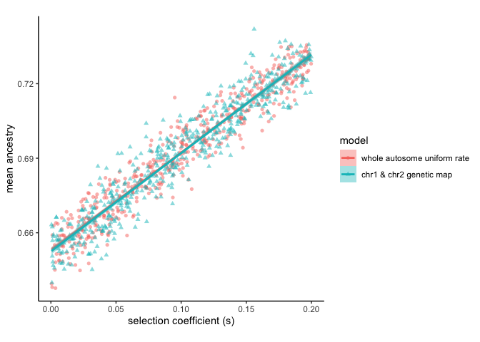
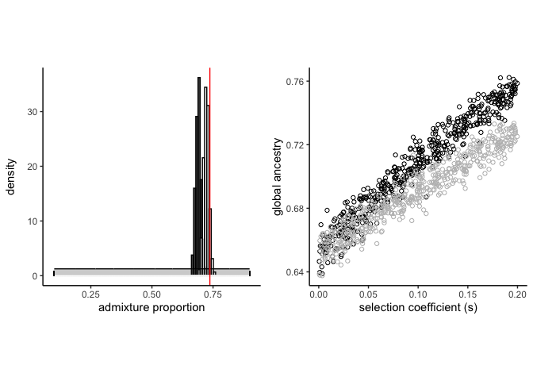

Untitled
================

``` r
suppressMessages(library(tidyverse))
suppressMessages(library(Hmisc))
suppressMessages(library(ggpubr))
suppressMessages(library(car))
```

``` r
whole_autosome <- read.table("globalancestry_whole-autosome.txt", header=TRUE)
two_chromosome <- read.table("globalancestry_two-chromosome.txt", header=TRUE)
```

``` r
whole_autosome$model <- "whole autosome uniform rate"
whole_autosome$global_ancestry <- whole_autosome$mean_global
two_chromosome$model <- "chr1 & chr2 genetic map"
two_chromosome$global_ancestry <- (two_chromosome$mean_chr1 * 0.08) + (two_chromosome$mean_restgenome * 0.92)

ancestry_ancova_df <- bind_rows(whole_autosome, two_chromosome)
ancestry_ancova_df <- ancestry_ancova_df[,c("model", "s", "global_ancestry")]
ancestry_ancova_df$model <- factor(ancestry_ancova_df$model, levels = c("whole autosome uniform rate", "chr1 & chr2 genetic map"))
```

``` r
modl <- aov(global_ancestry ~ s*model, data = ancestry_ancova_df)

#no significant interaction between selection strength
#and simulation model.
summary(modl)
```

    ##              Df Sum Sq Mean Sq   F value Pr(>F)    
    ## s             1 0.5092  0.5092 10511.197 <2e-16 ***
    ## model         1 0.0000  0.0000     0.163  0.686    
    ## s:model       1 0.0000  0.0000     0.140  0.709    
    ## Residuals   996 0.0483  0.0000                     
    ## ---
    ## Signif. codes:  0 '***' 0.001 '**' 0.01 '*' 0.05 '.' 0.1 ' ' 1

``` r
#slopes and intercepts are not significantly different
#between whole autosome uniform recombination rate vs
#two chromosome w/ human genetic map
modl2 <- aov(global_ancestry ~ s+model, data = ancestry_ancova_df)

summary(modl2)
```

    ##              Df Sum Sq Mean Sq   F value Pr(>F)    
    ## s             1 0.5092  0.5092 10520.275 <2e-16 ***
    ## model         1 0.0000  0.0000     0.164  0.686    
    ## Residuals   997 0.0483  0.0000                     
    ## ---
    ## Signif. codes:  0 '***' 0.001 '**' 0.01 '*' 0.05 '.' 0.1 ' ' 1

``` r
#simulation model does not have a significant effect
#on global ancesetry after removing effect of selection
Anova(modl2, type="III")
```

    ## Anova Table (Type III tests)
    ## 
    ## Response: global_ancestry
    ##             Sum Sq  Df    F value Pr(>F)    
    ## (Intercept) 84.750   1 1.7509e+06 <2e-16 ***
    ## s            0.509   1 1.0519e+04 <2e-16 ***
    ## model        0.000   1 1.6350e-01  0.686    
    ## Residuals    0.048 997                      
    ## ---
    ## Signif. codes:  0 '***' 0.001 '**' 0.01 '*' 0.05 '.' 0.1 ' ' 1

``` r
#fit regression lines for two models
reg1 <- lm(global_ancestry ~ s, data = whole_autosome) ; summary(reg1)
```

    ## 
    ## Call:
    ## lm(formula = global_ancestry ~ s, data = whole_autosome)
    ## 
    ## Residuals:
    ##        Min         1Q     Median         3Q        Max 
    ## -0.0178761 -0.0043831 -0.0002732  0.0045433  0.0240814 
    ## 
    ## Coefficients:
    ##              Estimate Std. Error t value Pr(>|t|)    
    ## (Intercept) 0.6529323  0.0005802 1125.42   <2e-16 ***
    ## s           0.3931565  0.0050417   77.98   <2e-16 ***
    ## ---
    ## Signif. codes:  0 '***' 0.001 '**' 0.01 '*' 0.05 '.' 0.1 ' ' 1
    ## 
    ## Residual standard error: 0.006514 on 498 degrees of freedom
    ## Multiple R-squared:  0.9243, Adjusted R-squared:  0.9242 
    ## F-statistic:  6081 on 1 and 498 DF,  p-value: < 2.2e-16

``` r
reg2 <- lm(global_ancestry ~ s, data = two_chromosome) ; summary(reg2)
```

    ## 
    ## Call:
    ## lm(formula = global_ancestry ~ s, data = two_chromosome)
    ## 
    ## Residuals:
    ##        Min         1Q     Median         3Q        Max 
    ## -0.0198352 -0.0047279 -0.0004163  0.0048135  0.0276891 
    ## 
    ## Coefficients:
    ##              Estimate Std. Error t value Pr(>|t|)    
    ## (Intercept) 0.6524693  0.0006632  983.82   <2e-16 ***
    ## s           0.3960340  0.0058320   67.91   <2e-16 ***
    ## ---
    ## Signif. codes:  0 '***' 0.001 '**' 0.01 '*' 0.05 '.' 0.1 ' ' 1
    ## 
    ## Residual standard error: 0.00738 on 498 degrees of freedom
    ## Multiple R-squared:  0.9025, Adjusted R-squared:  0.9023 
    ## F-statistic:  4611 on 1 and 498 DF,  p-value: < 2.2e-16

``` r
ggplot(ancestry_ancova_df, aes(s, global_ancestry, colour = model)) +
    geom_point(aes(shape = model), alpha=0.5) + 
    geom_smooth(method = "lm", aes(fill = model)) +
    labs(x = "selection coefficient (s)", y = "mean ancestry") +
    theme_classic() +
    theme(aspect.ratio = 1)
```

    ## `geom_smooth()` using formula 'y ~ x'

<!-- -->

``` r
whole_autosome$artificial_ancestry <- (whole_autosome$mean_chr1 * 0.08) + (whole_autosome$m * 0.92)

ancestry_vs_selection <- ggplot(whole_autosome) +
  geom_point(aes(x=s, y= global_ancestry), color = "black", shape = 1) +
  geom_point(aes(x=s, y =artificial_ancestry), color = "grey", shape = 1) +
  xlab("selection coefficient (s)") +
  ylab("global ancestry") +
  theme_classic() +
  theme(aspect.ratio = 1)
```

``` r
ABC_accepted_whole_autosome <- read.table("globalancestry_ABC-accepted.txt", header=TRUE)
```

``` r
prior_m <- runif(1000, min=0.1, max=0.9)
y <- dunif(prior_m, min=0.1, max = 0.9)

admixture_ABC <- ggplot() +
  geom_histogram(data=ABC_accepted_whole_autosome, aes(x = m, y= ..density..), color = "#000000", fill = "#000000", alpha=0.75, binwidth = 0.009) +
  geom_histogram(data= ABC_accepted_whole_autosome, aes(x=mean_global, y = ..density..), , color = "#000000", alpha=0.75, fill = "white", binwidth = 0.009) +
  geom_line(aes(x=prior_m, y = y)) +
  geom_area(aes(x=prior_m, y = y), alpha = 0.25) +
  geom_hline(yintercept = 0, color = "white", size = 0.77) +
  geom_segment(aes(x=0.1, y=0, xend=0.1, yend=y), linetype = "dashed") +
  geom_segment(aes(x=0.9, y=0, xend=0.9, yend=y), linetype = "dashed") +
  geom_vline(xintercept = 0.737, color = "red") +
  xlab("admixture proportion") +
  theme_classic() +
  theme(aspect.ratio = 1)
```

``` r
ggarrange(admixture_ABC, ancestry_vs_selection, nrow=1, ncol=2, heights = c(1,1), widths=c(1,1), align = "hv")
```

<!-- -->
