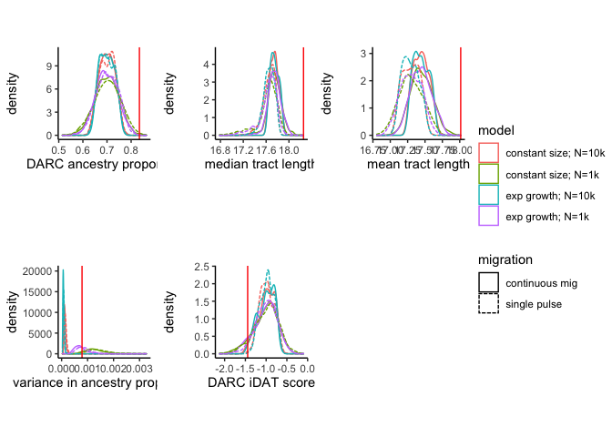
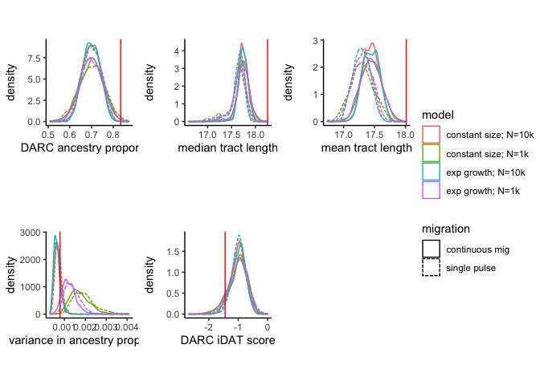

Neutral Sims Plot
================

``` r
suppressMessages(library(tidyverse))
suppressMessages(library(ggpubr))
suppressMessages(library(Hmisc))
```

## plot neutral ancestry stats distributions

### Full Population Data

``` r
cv_const_1000_singlepulse <- read.table(file="CV_neutral_const-1000_single-pulse.txt", header=TRUE)
cv_const_1000_contadm <- read.table(file="CV_neutral_const-1000_cont-adm.txt", header=TRUE)
cv_const_10000_singlepulse <- read.table(file="CV_neutral_const-10000_single-pulse.txt", header=TRUE)
cv_const_10000_contadm <- read.table(file="CV_neutral_const-10000_cont-adm.txt", header=TRUE)

cv_exp_1000_singlepulse <- read.table(file="CV_neutral_exp-05-1000_single-pulse.txt", header=TRUE)
cv_exp_1000_contadm <- read.table("CV_neutral_exp-05-1000_cont-adm.txt", header=TRUE)
cv_exp_10000_singlepulse <- read.table(file="CV_neutral_exp-05-10000_single-pulse.txt", header=TRUE)
cv_exp_10000_contadm <- read.table(file="CV_neutral_exp-05-10000_cont-adm.txt", header=TRUE)
```

``` r
cv_const_1000_singlepulse$model <- "constant size; N=1k"
cv_const_1000_contadm$model <- "constant size; N=1k"
cv_const_10000_singlepulse$model <- "constant size; N=10k"
cv_const_10000_contadm$model <- "constant size; N=10k"
cv_exp_1000_singlepulse$model <- "exp growth; N=1k"
cv_exp_1000_contadm$model <- "exp growth; N=1k"
cv_exp_10000_singlepulse$model <- "exp growth; N=10k"
cv_exp_10000_contadm$model <- "exp growth; N=10k"

cv_const_1000_singlepulse$adm <- "single pulse"
cv_const_1000_contadm$adm <- "continuous mig"
cv_const_10000_singlepulse$adm <- "single pulse"
cv_const_10000_contadm$adm <- "continuous mig"
cv_exp_1000_singlepulse$adm <- "single pulse"
cv_exp_1000_contadm$adm <- "continuous mig"
cv_exp_10000_singlepulse$adm <- "single pulse"
cv_exp_10000_contadm$adm <- "continuous mig"

CV_neutral_all <- bind_rows(cv_const_1000_singlepulse, cv_const_1000_contadm, 
                            cv_const_10000_singlepulse, cv_const_10000_contadm, 
                            cv_exp_1000_singlepulse, cv_exp_1000_contadm, 
                            cv_exp_10000_singlepulse,cv_exp_10000_contadm)
```

``` r
CV_stats <- read.table(file="CV_stats.txt", header=TRUE)
```

``` r
bene_prop_plot <- ggplot(CV_neutral_all) +
  geom_density(mapping=aes(x=bene_prop, linetype = adm, color = model)) +
  geom_vline(xintercept = CV_stats$bene_prop[1], color = "red") +
  labs(x="DARC ancestry proportion", linetype = "migration") +
  theme_classic() +
  theme(aspect.ratio = 1)

median_tract_plot <- ggplot(CV_neutral_all) +
  geom_density(mapping=aes(x=median_tract, linetype = adm, color = model)) +
  geom_vline(xintercept = CV_stats$median_tract[1], color = "red") +
  labs(x="median tract length", linetype = "migration") +
  theme_classic() +
  theme(aspect.ratio = 1)

mean_tract_plot <- ggplot(CV_neutral_all) +
  geom_density(mapping=aes(x=mean_tract, linetype = adm, color = model)) +
  geom_vline(xintercept = CV_stats$mean_tract[1], color = "red") +
  labs(x="mean tract length", linetype = "migration") +
  theme_classic() +
  theme(aspect.ratio = 1)

var_prop_plot <- ggplot(CV_neutral_all) +
  geom_density(mapping=aes(x=var_prop, linetype = adm, color = model)) +
  geom_vline(xintercept = CV_stats$var_prop[1], color = "red") +
  labs(x="variance in ancestry proportion", linetype = "migration") +
  theme_classic() +
  theme(aspect.ratio = 1)

iDAT_score_plot <- ggplot(CV_neutral_all) +
  geom_density(mapping=aes(x=iDAT_score, linetype = adm, color = model)) +
  geom_vline(xintercept = CV_stats$iDAT_score[1], color = "red") +
  labs(x="DARC iDAT score", linetype = "migration") +
  theme_classic() +
  theme(aspect.ratio = 1)
```

``` r
ggarrange(bene_prop_plot, median_tract_plot, mean_tract_plot, var_prop_plot,
          iDAT_score_plot, nrow=2, ncol=3, align = "hv", heights = c(1,1,1,1,1), widths = c(1,1,1,1,1), common.legend = TRUE, legend = "right")
```

<!-- -->

### Sample of 172 random individuals

``` r
cv_const_1000_singlepulse_sample <- read.table(file="CV_neutral_const-1000_single-pulse_sample.txt", header=TRUE)
cv_const_1000_contadm_sample <- read.table(file="CV_neutral_const-1000_cont-adm_sample.txt", header=TRUE)
cv_const_10000_singlepulse_sample <- read.table(file="CV_neutral_const-10000_single-pulse_sample.txt", header=TRUE)
cv_const_10000_contadm_sample <- read.table(file="CV_neutral_const-10000_cont-adm_sample.txt", header=TRUE)

cv_exp_1000_singlepulse_sample <- read.table(file="CV_neutral_exp-05-1000_single-pulse_sample.txt", header=TRUE)
cv_exp_1000_contadm_sample <- read.table("CV_neutral_exp-05-1000_cont-adm_sample.txt", header=TRUE)
cv_exp_10000_singlepulse_sample <- read.table(file="CV_neutral_exp-05-10000_single-pulse_sample.txt", header=TRUE)
cv_exp_10000_contadm_sample <- read.table(file="CV_neutral_exp-05-10000_cont-adm_sample.txt", header=TRUE)
```

``` r
cv_const_1000_singlepulse_sample$model <- "constant size; N=1k"
cv_const_1000_contadm_sample$model <- "constant size; N=1k"
cv_const_10000_singlepulse_sample$model <- "constant size; N=10k"
cv_const_10000_contadm_sample$model <- "constant size; N=10k"
cv_exp_1000_singlepulse_sample$model <- "exp growth; N=1k"
cv_exp_1000_contadm_sample$model <- "exp growth; N=1k"
cv_exp_10000_singlepulse_sample$model <- "exp growth; N=10k"
cv_exp_10000_contadm_sample$model <- "exp growth; N=10k"

cv_const_1000_singlepulse_sample$adm <- "single pulse"
cv_const_1000_contadm_sample$adm <- "continuous mig"
cv_const_10000_singlepulse_sample$adm <- "single pulse"
cv_const_10000_contadm_sample$adm <- "continuous mig"
cv_exp_1000_singlepulse_sample$adm <- "single pulse"
cv_exp_1000_contadm_sample$adm <- "continuous mig"
cv_exp_10000_singlepulse_sample$adm <- "single pulse"
cv_exp_10000_contadm_sample$adm <- "continuous mig"

CV_neutral_all_sample <- bind_rows(cv_const_1000_singlepulse_sample, cv_const_1000_contadm_sample, 
                            cv_const_10000_singlepulse_sample, cv_const_10000_contadm_sample, 
                            cv_exp_1000_singlepulse_sample, cv_exp_1000_contadm_sample, 
                            cv_exp_10000_singlepulse_sample,cv_exp_10000_contadm_sample)
```

``` r
bene_prop_plot_sample <- ggplot(CV_neutral_all_sample) +
  geom_density(mapping=aes(x=bene_prop, linetype = adm, color = model)) +
  geom_vline(xintercept = CV_stats$bene_prop[1], color = "red") +
  labs(x="DARC ancestry proportion", linetype = "migration") +
  theme_classic() +
  theme(aspect.ratio = 1)

median_tract_plot_sample <- ggplot(CV_neutral_all_sample) +
  geom_density(mapping=aes(x=median_tract, linetype = adm, color = model)) +
  geom_vline(xintercept = CV_stats$median_tract[1], color = "red") +
  labs(x="median tract length", linetype = "migration") +
  theme_classic() +
  theme(aspect.ratio = 1)

mean_tract_plot_sample <- ggplot(CV_neutral_all_sample) +
  geom_density(mapping=aes(x=mean_tract, linetype = adm, color = model)) +
  geom_vline(xintercept = CV_stats$mean_tract[1], color = "red") +
  labs(x="mean tract length", linetype = "migration") +
  theme_classic() +
  theme(aspect.ratio = 1)

var_prop_plot_sample <- ggplot(CV_neutral_all_sample) +
  geom_density(mapping=aes(x=var_prop, linetype = adm, color = model)) +
  geom_vline(xintercept = CV_stats$var_prop[1], color = "red") +
  labs(x="variance in ancestry proportion", linetype = "migration") +
  theme_classic() +
  theme(aspect.ratio = 1)

iDAT_score_plot_sample <- ggplot(CV_neutral_all_sample) +
  geom_density(mapping=aes(x=iDAT_score, linetype = adm, color = model)) +
  geom_vline(xintercept = CV_stats$iDAT_score[1], color = "red") +
  labs(x="DARC iDAT score", linetype = "migration") +
  theme_classic() +
  theme(aspect.ratio = 1)
```

``` r
ggarrange(bene_prop_plot_sample, median_tract_plot_sample, mean_tract_plot_sample, var_prop_plot_sample,
          iDAT_score_plot_sample, nrow=2, ncol=3, align = "hv", heights = c(1,1,1,1,1), widths = c(1,1,1,1,1), common.legend = TRUE, legend = "right")
```

<!-- -->
