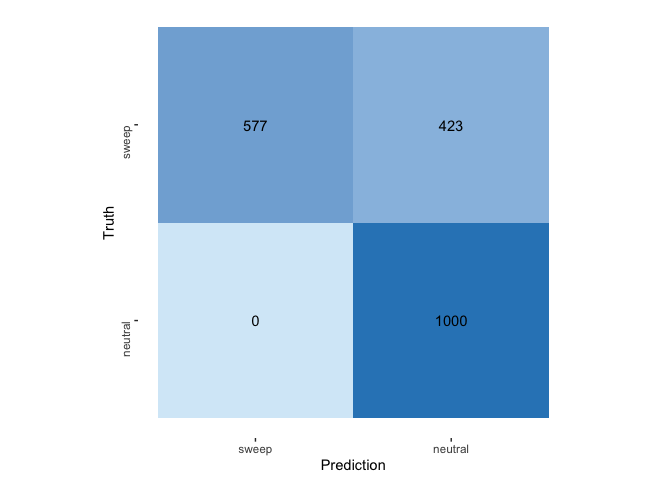
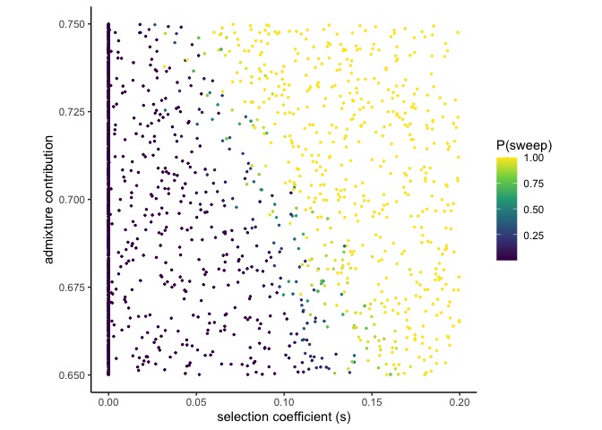

SWIFr Validation
================

``` r
suppressMessages(library(tidyverse))
suppressMessages(library(e1071))
suppressMessages(library(yardstick))
```

``` r
SWIFr_preds <- read.table(file = "CV_SWIFr_1keach_prior002_5stats_test.txt", header=TRUE)
```

# ADD PRECISION RECALL PLOT\!\!\!\!

``` r
SWIFr_preds$pred <- as.factor(ifelse(SWIFr_preds$P.sweep.>0.5, 1, 0))
SWIFr_preds$target <- as.factor(ifelse(SWIFr_preds$s==0, 0, 1))
```

``` r
cm <- conf_mat(SWIFr_preds, target, pred)
autoplot(cm, type = "heatmap") +
  scale_fill_gradient(low="#D6EAF8",high = "#2E86C1") +
  scale_y_discrete(labels = c("sweep", "neutral")) +
  scale_x_discrete(labels=c("neutral", "sweep")) +
  coord_flip() +
  theme(aspect.ratio = 1, axis.text.y = element_text(angle = 90))
```

<!-- -->

``` r
ggplot() +
  geom_point(data=SWIFr_preds, aes(x=s, y=m, color=P.sweep.), size = 0.5) +
  scale_color_viridis_c() +
  labs(x="selection coefficient (s)", y = "admixture contribution", color = "P(sweep)") +
  theme_classic() +
  theme(aspect.ratio = 1)
```

<!-- -->
