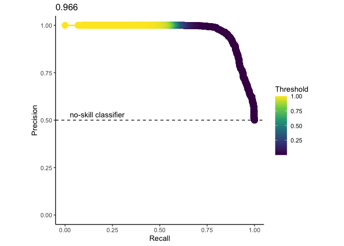
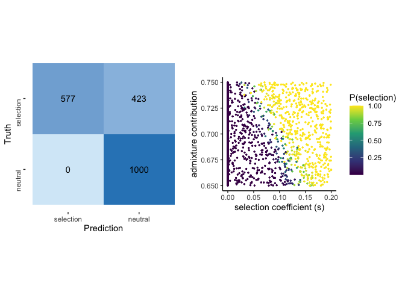

SWIFr Validation
================

``` r
suppressMessages(library(tidyverse))
suppressMessages(library(reshape2))
suppressMessages(library(PRROC))
```

    ## Warning: package 'PRROC' was built under R version 4.0.2

``` r
suppressMessages(library(e1071))
suppressMessages(library(yardstick))
suppressMessages(library(Hmisc))
suppressMessages(library(ggpubr))
```

``` r
SWIFr_preds <- read.table(file = "CV_SWIFr_1keach_prior002_5stats_test.txt", header=TRUE)
```

## Precision-recall analysis

Here we plot the precision-recall curve for the SWIF(r) run using 5
ancestry-based statistics.

To generate the data plotted below:

The SWIF(r) v1 release (2017) was run using python v2.7 according to the
documentation at <https://github.com/ramachandran-lab/SWIFr>

In a directory containg a simulations directory with 50,000 neutral and
100 sweeps, we made the following 2 text files:

1)  classes.txt - containing the classes (“neutral” or “sweep”)

2)  component\_stats.txt - containing the 5 summary stats we used
    (“bene\_prop”, “var\_prop”, “mean\_tract”, “median\_tract”, and
    “iDAT\_score”)

We trained SWIF(r) using the following command:

    python ../SWIFr-master/SWIFr_train.py --path .

Then, we ran SWIF(r) using 1000 neutral simulations and 1000 simulated
sweeps:

    python ../SWIFr-master/SWIFr.py --path2trained . --pi 0.998 0.002 --file CV_SWIFr_1keach.test

Note that the prior sweep probability (0.2%) reflects the training set
proportions.

``` r
#Format the data for plotting:
classtest = SWIFr_preds[,c("s", "P.neutral.","P.sweep.")]
classLong <- melt(classtest,id.vars = c("s"))
actualsweep <- subset(classtest, s>0)
neutral <- subset(classtest, s<0.00001)
```

``` r
#Generate the PR curve:
pr<-pr.curve(scores.class0 = actualsweep$P.sweep., scores.class1 = neutral$P.sweep., curve=TRUE)
roc<-roc.curve(scores.class0 = actualsweep$P.sweep., scores.class1 = neutral$P.sweep., curve=TRUE)
curve.points<-pr$curve
ggplot(data.frame(pr$curve),aes(x=X1,y=X2,color=X3))+
  geom_line(size=1)+
  geom_hline(yintercept=0.5, linetype="dashed")+
  labs(x="Recall",y="Precision",title=format(pr$auc.integral,digits=3),colour="Threshold")+
  annotate(geom="text", x=0.17, y=0.53, label="no-skill classifier")+
  scale_color_viridis_c()+
  geom_point(size=4)+
  coord_fixed()+
  scale_y_continuous(limits = c(0,1))+
  theme_classic()
```

<!-- -->

## SWIF(r) performance for each class and across parameters

``` r
SWIFr_preds$pred <- as.factor(ifelse(SWIFr_preds$P.sweep.>0.5, 1, 0))
SWIFr_preds$target <- as.factor(ifelse(SWIFr_preds$s==0, 0, 1))
```

``` r
cm <- conf_mat(SWIFr_preds, target, pred)
SWIFr_cm <- autoplot(cm, type = "heatmap") +
  scale_fill_gradient(low="#D6EAF8",high = "#2E86C1") +
  scale_y_discrete(labels = c("sweep", "neutral")) +
  scale_x_discrete(labels=c("neutral", "sweep")) +
  coord_flip() +
  theme(aspect.ratio = 1, axis.text.y = element_text(angle = 90))
```

``` r
SWIfr_scatterplot <- ggplot() +
  geom_point(data=SWIFr_preds, aes(x=s, y=m, color=P.sweep.), size = 0.5) +
  scale_color_viridis_c() +
  labs(x="selection coefficient (s)", y = "admixture contribution", color = "P(sweep)") +
  theme_classic() +
  theme(aspect.ratio = 1)
```

``` r
ggarrange(SWIFr_cm, SWIfr_scatterplot, ncol = 2, nrow=1, heights = c(0.85,1), widths=c(0.85,1), align = "h")
```

<!-- -->
