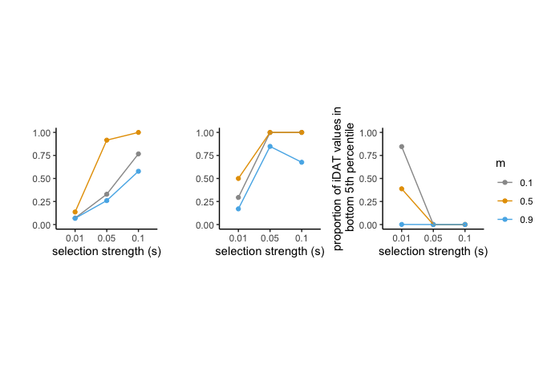
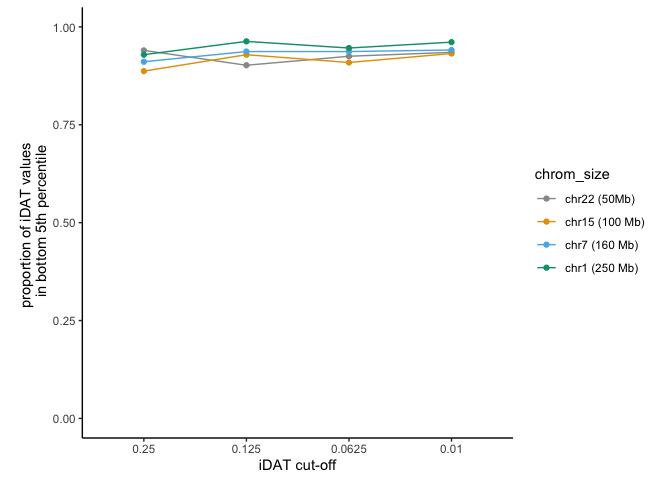

iDAT performance plots
================

## admixture timing and migration proportion

### simulation datasets

``` r
#GEN 10 MIG 10
gen10_m10_s0 <- read.table(file="gen-10_mig-10_s-0_const-00-10000_single-pulse.txt", header=TRUE)
gen10_m10_s01 <- read.table(file="gen-10_mig-10_s-0.01_const-00-10000_single-pulse.txt", header=TRUE)
gen10_m10_s05 <- read.table(file="gen-10_mig-10_s-0.05_const-00-10000_single-pulse.txt", header=TRUE)
gen10_m10_s1 <- read.table(file="gen-10_mig-10_s-0.1_const-00-10000_single-pulse.txt", header=TRUE)

#GEN 10 MIG 50
gen10_m50_s0 <- read.table(file="gen-10_mig-50_s-0_const-00-10000_single-pulse.txt", header=TRUE)
gen10_m50_s01 <- read.table(file="gen-10_mig-50_s-0.01_const-00-10000_single-pulse.txt", header=TRUE)
gen10_m50_s05 <- read.table(file="gen-10_mig-50_s-0.05_const-00-10000_single-pulse.txt", header=TRUE)
gen10_m50_s1 <- read.table(file="gen-10_mig-50_s-0.1_const-00-10000_single-pulse.txt", header=TRUE)

#GEN 10 MIG 90
gen10_m90_s0 <- read.table(file="gen-10_mig-90_s-0_const-00-10000_single-pulse.txt", header=TRUE)
gen10_m90_s01 <- read.table(file="gen-10_mig-90_s-0.01_const-00-10000_single-pulse.txt", header=TRUE)
gen10_m90_s05 <- read.table(file="gen-10_mig-90_s-0.05_const-00-10000_single-pulse.txt", header=TRUE)
gen10_m90_s1 <- read.table(file="gen-10_mig-90_s-0.1_const-00-10000_single-pulse.txt", header=TRUE)

#GEN 100 MIG 10
gen100_m10_s0 <- read.table(file="gen-100_mig-10_s-0_const-00-10000_single-pulse.txt", header=TRUE)
gen100_m10_s01 <- read.table(file="gen-100_mig-10_s-0.01_const-00-10000_single-pulse.txt", header=TRUE)
gen100_m10_s05 <- read.table(file="gen-100_mig-10_s-0.05_const-00-10000_single-pulse.txt", header=TRUE)
gen100_m10_s1 <- read.table(file="gen-100_mig-10_s-0.1_const-00-10000_single-pulse.txt", header=TRUE)

#GEN 100 MIG 50
gen100_m50_s0 <- read.table(file="gen-100_mig-50_s-0_const-00-10000_single-pulse.txt", header=TRUE)
gen100_m50_s01 <- read.table(file="gen-100_mig-50_s-0.01_const-00-10000_single-pulse.txt", header=TRUE)
gen100_m50_s05 <- read.table(file="gen-100_mig-50_s-0.05_const-00-10000_single-pulse.txt", header=TRUE)
gen100_m50_s1 <- read.table(file="gen-100_mig-50_s-0.1_const-00-10000_single-pulse.txt", header=TRUE)

#GEN 100 MIG 90
gen100_m90_s0 <- read.table(file="gen-100_mig-90_s-0_const-00-10000_single-pulse.txt", header=TRUE)
gen100_m90_s01 <- read.table(file="gen-100_mig-90_s-0.01_const-00-10000_single-pulse.txt", header=TRUE)
gen100_m90_s05 <- read.table(file="gen-100_mig-90_s-0.05_const-00-10000_single-pulse.txt", header=TRUE)
gen100_m90_s1 <- read.table(file="gen-100_mig-90_s-0.1_const-00-10000_single-pulse.txt", header=TRUE)

#GEN 1000 MIG 10
gen1000_m10_s0 <- read.table(file="gen-1000_mig-10_s-0_const-00-10000_single-pulse.txt", header=TRUE)
gen1000_m10_s01 <- read.table(file="gen-1000_mig-10_s-0.01_const-00-10000_single-pulse.txt", header=TRUE)
gen1000_m10_s05 <- read.table(file="gen-1000_mig-10_s-0.05_const-00-10000_single-pulse.txt", header=TRUE)
gen1000_m10_s1 <- read.table(file="gen-1000_mig-10_s-0.1_const-00-10000_single-pulse.txt", header=TRUE)

#GEN 1000 MIG 50
gen1000_m50_s0 <- read.table(file="gen-1000_mig-50_s-0_const-00-10000_single-pulse.txt", header=TRUE)
gen1000_m50_s01 <- read.table(file="gen-1000_mig-50_s-0.01_const-00-10000_single-pulse.txt", header=TRUE)
gen1000_m50_s05 <- read.table(file="gen-1000_mig-50_s-0.05_const-00-10000_single-pulse.txt", header=TRUE)
gen1000_m50_s1 <- read.table(file="gen-1000_mig-50_s-0.1_const-00-10000_single-pulse.txt", header=TRUE)

#GEN 1000 MIG 90
gen1000_m90_s0 <- read.table(file="gen-1000_mig-90_s-0_const-00-10000_single-pulse.txt", header=TRUE)
gen1000_m90_s01 <- read.table(file="gen-1000_mig-90_s-0.01_const-00-10000_single-pulse.txt", header=TRUE)
gen1000_m90_s05 <- read.table(file="gen-1000_mig-90_s-0.05_const-00-10000_single-pulse.txt", header=TRUE)
gen1000_m90_s1 <- read.table(file="gen-1000_mig-90_s-0.1_const-00-10000_single-pulse.txt", header=TRUE)
```

### performance

Calculate the proportion of selection simulations that have *iDAT*
values in the bottom 5th percentile of the respective neutral *iDAT*
distributions.

``` r
s <- rep(c(0.01, 0.05, 0.1), 3)
m <- as.factor(rep(c(0.1, 0.5, 0.9), times=1, each=3))
gen10_percentile <- c(sum(gen10_m10_s01$iDAT_score_25 <= quantile(gen10_m10_s0$iDAT_score_25, 0.05))/1000,
                      sum(gen10_m10_s05$iDAT_score_25 <= quantile(gen10_m10_s0$iDAT_score_25, 0.05))/1000,
                      sum(gen10_m10_s1$iDAT_score_25 <= quantile(gen10_m10_s0$iDAT_score_25, 0.05))/1000,
                      sum(gen10_m50_s01$iDAT_score_25 <= quantile(gen10_m50_s0$iDAT_score_25, 0.05))/1000,
                      sum(gen10_m50_s05$iDAT_score_25 <= quantile(gen10_m50_s0$iDAT_score_25, 0.05))/1000,
                      sum(gen10_m50_s1$iDAT_score_25 <= quantile(gen10_m50_s0$iDAT_score_25, 0.05))/1000,
                      sum(gen10_m90_s01$iDAT_score_25 <= quantile(gen10_m90_s0$iDAT_score_25, 0.05))/1000,
                      sum(gen10_m90_s05$iDAT_score_25 <= quantile(gen10_m90_s0$iDAT_score_25, 0.05))/1000, 
                      sum(gen10_m90_s1$iDAT_score_25 <= quantile(gen10_m90_s0$iDAT_score_25, 0.05))/1000)

#older admixture will have some -Inf values because the variant fixed in the population. These should not count as being in the bottom 5th percentile of neutral simulations.

gen100_percentile <- c(sum(gen100_m10_s01$iDAT_score_25[is.finite(gen100_m10_s01$iDAT_score_25)] <= quantile(gen100_m10_s0$iDAT_score_25, 0.05))/1000,
                       sum(gen100_m10_s05$iDAT_score_25[is.finite(gen100_m10_s05$iDAT_score_25)] <= quantile(gen100_m10_s0$iDAT_score_25, 0.05))/1000,
                       sum(gen100_m10_s1$iDAT_score_25[is.finite(gen100_m10_s1$iDAT_score_25)] <= quantile(gen100_m10_s0$iDAT_score_25, 0.05))/1000,
                       sum(gen100_m50_s01$iDAT_score_25[is.finite(gen100_m50_s01$iDAT_score_25)] <= quantile(gen100_m50_s0$iDAT_score_25, 0.05))/1000,
                       sum(gen100_m50_s05$iDAT_score_25[is.finite(gen100_m50_s05$iDAT_score_25)] <= quantile(gen100_m50_s0$iDAT_score_25, 0.05))/1000,
                       sum(gen100_m50_s1$iDAT_score_25[is.finite(gen100_m50_s1$iDAT_score_25)] <= quantile(gen100_m50_s0$iDAT_score_25, 0.05))/1000,
                       sum(gen100_m90_s01$iDAT_score_25[is.finite(gen100_m90_s01$iDAT_score_25)] <= quantile(gen100_m90_s0$iDAT_score_25, 0.05))/1000,
                       sum(gen100_m90_s05$iDAT_score_25[is.finite(gen100_m90_s05$iDAT_score_25)] <= quantile(gen100_m90_s0$iDAT_score_25, 0.05))/1000, 
                       sum(gen100_m90_s1$iDAT_score_25[is.finite(gen100_m90_s1$iDAT_score_25)] <= quantile(gen100_m90_s0$iDAT_score_25, 0.05))/1000)


gen1000_percentile <- c(sum(gen1000_m10_s01$iDAT_score_25[is.finite(gen1000_m10_s01$iDAT_score_25)] <= quantile(gen1000_m10_s0$iDAT_score_25, 0.05))/1000,
                       sum(gen1000_m10_s05$iDAT_score_25[is.finite(gen1000_m10_s05$iDAT_score_25)] <= quantile(gen1000_m10_s0$iDAT_score_25, 0.05))/1000,
                       sum(gen1000_m10_s1$iDAT_score_25[is.finite(gen1000_m10_s1$iDAT_score_25)] <= quantile(gen1000_m10_s0$iDAT_score_25, 0.05))/1000,
                       sum(gen1000_m50_s01$iDAT_score_25[is.finite(gen1000_m50_s01$iDAT_score_25)] <= quantile(gen1000_m50_s0$iDAT_score_25, 0.05))/1000,
                       sum(gen1000_m50_s05$iDAT_score_25[is.finite(gen1000_m50_s05$iDAT_score_25)] <= quantile(gen1000_m50_s0$iDAT_score_25, 0.05))/1000,
                       sum(gen1000_m50_s1$iDAT_score_25[is.finite(gen1000_m50_s1$iDAT_score_25)] <= quantile(gen1000_m50_s0$iDAT_score_25, 0.05))/1000,
                       sum(gen1000_m90_s01$iDAT_score_25[is.finite(gen1000_m90_s01$iDAT_score_25)] <= quantile(gen1000_m90_s0$iDAT_score_25, 0.05))/1000,
                       sum(gen1000_m90_s05$iDAT_score_25[is.finite(gen1000_m90_s05$iDAT_score_25)] <= quantile(gen1000_m90_s0$iDAT_score_25, 0.05))/1000, 
                       sum(gen1000_m90_s1$iDAT_score_25[is.finite(gen1000_m90_s1$iDAT_score_25)] <= quantile(gen1000_m90_s0$iDAT_score_25, 0.05))/1000)

genall_percentiles <- data.frame(s, m, gen10_percentile, gen100_percentile, gen1000_percentile)

cbp1 <- c("#999999", "#E69F00", "#56B4E9", "#009E73",
          "#F0E442", "#0072B2", "#D55E00", "#CC79A7")

gen10_plot <- ggplot(genall_percentiles, aes(x=as.factor(s), y=gen10_percentile, color=m, group=m)) +
  geom_point() +
  geom_line() +
  scale_y_continuous(limits=c(0,1))+
  scale_color_manual(values=cbp1) +
  labs(x="selection strength (s)", y = "proportion of iDAT values in\n bottom 5th percentile") +
  theme_classic() +
  theme(aspect.ratio = 1, axis.title.y = element_blank())

gen100_plot <- ggplot(genall_percentiles, aes(x=as.factor(s), y=gen100_percentile, color=m, group=m)) +
  geom_point() +
  geom_line() +
  scale_color_manual(values=cbp1) +
  scale_y_continuous(limits=c(0,1))+
  labs(x="selection strength (s)") +
  theme_classic() +
  theme(aspect.ratio = 1, axis.title.y = element_blank())

gen1000_plot <- ggplot(genall_percentiles, aes(x=as.factor(s), y=gen1000_percentile, color=m, group=m)) +
  geom_point() +
  geom_line() +
  scale_y_continuous(limits=c(0,1))+
  scale_color_manual(values=cbp1) +
  labs(x="selection strength (s)", y = "proportion of iDAT values in\n bottom 5th percentile") +
  theme_classic() +
  theme(aspect.ratio = 1)

ggarrange(gen10_plot, gen100_plot, gen1000_plot, align = "hv", nrow=1, common.legend = TRUE, legend="right")
```

<!-- -->

## chromosome-size simulations

### simulation datasets

``` r
chr1_s0 <- read.table(file="chr1_s-0_const-00-10000_single-pulse.txt", header=TRUE)
chr1_s05 <- read.table(file="chr1_s-05_const-00-10000_single-pulse.txt", header=TRUE)

chr7_s0 <- read.table(file="chr7_s-0_const-00-10000_single-pulse.txt", header=TRUE)
chr7_s05 <- read.table(file="chr7_s-05_const-00-10000_single-pulse.txt", header=TRUE)

chr15_s0 <- read.table(file="chr15_s-0_const-00-10000_single-pulse.txt", header=TRUE)
chr15_s05 <- read.table(file="chr15_s-05_const-00-10000_single-pulse.txt", header=TRUE)

chr22_s0 <- read.table(file="chr22_s-0_const-00-10000_single-pulse.txt", header=TRUE)
chr22_s05 <- read.table(file="chr22_s-05_const-00-10000_single-pulse.txt", header=TRUE)
```

### performance

``` r
chrom_size <- rep(c("chr22 (50Mb)", "chr15 (100 Mb)", "chr7 (160 Mb)", "chr1 (250 Mb)"), times=1, each=4)
chrom_size <- factor(chrom_size, levels=c("chr22 (50Mb)", "chr15 (100 Mb)", "chr7 (160 Mb)", "chr1 (250 Mb)"))

iDAT_cutoff <- rep(c("0.25", "0.125", "0.0625", "0.01"), 4)
iDAT_cutoff <- factor(iDAT_cutoff, levels=c("0.25", "0.125", "0.0625", "0.01"))

chr22_percentile <- c(sum(chr22_s05$iDAT_score_25 <= quantile(chr22_s0$iDAT_score_25, 0.05))/1000,
                      sum(chr22_s05$iDAT_score_125 <= quantile(chr22_s0$iDAT_score_125, 0.05))/1000,
                      sum(chr22_s05$iDAT_score_0625 <= quantile(chr22_s0$iDAT_score_0625, 0.05))/1000,
                      sum(chr22_s05$iDAT_score_01 <= quantile(chr22_s0$iDAT_score_01, 0.05))/1000)

chr15_percentile <- c(sum(chr15_s05$iDAT_score_25 <= quantile(chr15_s0$iDAT_score_25, 0.05))/1000,
                      sum(chr15_s05$iDAT_score_125 <= quantile(chr15_s0$iDAT_score_125, 0.05))/1000,
                      sum(chr15_s05$iDAT_score_0625 <= quantile(chr15_s0$iDAT_score_0625, 0.05))/1000,
                      sum(chr15_s05$iDAT_score_01 <= quantile(chr15_s0$iDAT_score_01, 0.05))/1000)

chr7_percentile <- c(sum(chr7_s05$iDAT_score_25 <= quantile(chr7_s0$iDAT_score_25, 0.05))/1000,
                      sum(chr7_s05$iDAT_score_125 <= quantile(chr7_s0$iDAT_score_125, 0.05))/1000,
                      sum(chr7_s05$iDAT_score_0625 <= quantile(chr7_s0$iDAT_score_0625, 0.05))/1000,
                      sum(chr7_s05$iDAT_score_01 <= quantile(chr7_s0$iDAT_score_01, 0.05))/1000)

chr1_percentile <- c(sum(chr1_s05$iDAT_score_25 <= quantile(chr1_s0$iDAT_score_25, 0.05))/1000,
                      sum(chr1_s05$iDAT_score_125 <= quantile(chr1_s0$iDAT_score_125, 0.05))/1000,
                      sum(chr1_s05$iDAT_score_0625 <= quantile(chr1_s0$iDAT_score_0625, 0.05))/1000,
                      sum(chr1_s05$iDAT_score_01 <= quantile(chr1_s0$iDAT_score_01, 0.05))/1000)

chrsize_allpercentile <- c(chr22_percentile, chr15_percentile, chr7_percentile, chr1_percentile)


chrsize_all <- data.frame(chrom_size, iDAT_cutoff, chrsize_allpercentile)

ggplot(chrsize_all, aes(x=iDAT_cutoff, y=chrsize_allpercentile, color=chrom_size, group=chrom_size)) +
  geom_point() +
  geom_line() +
  scale_color_manual(values=cbp1) +
  scale_y_continuous(limits = c(0,1)) +
  labs(x="iDAT cut-off", y="proportion of iDAT values \n in bottom 5th percentile") +
  theme_classic() +
  theme(aspect.ratio = 1)
```

<!-- -->
